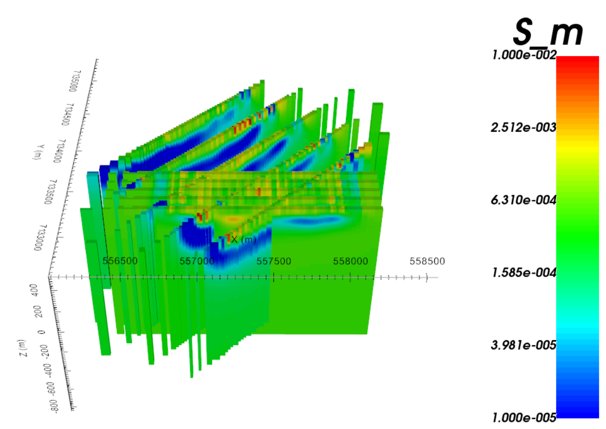
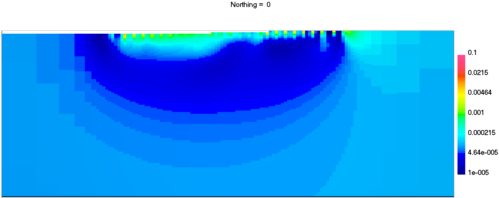
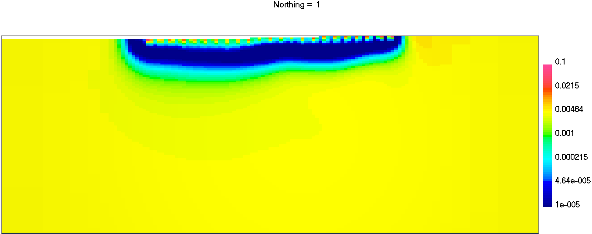

.. _AtoZDCIP_2DInversion:

2D Inversion
============

In this section, we will invert the :ref:`simulated data <AtoZdcip_Forward>`
in 2D as a pre-processing step for the 3D inversion.

Setup for the Exercise
----------------------

    - `Download the demo <https://github.com/ubcgif/GIFtoolsCookbook/raw/master/assets/AtoZ_DCIP_4Download.zip>`_
    - Open GIFtools
    - :ref:`Set the working directory <projSetWorkDir>`

.. tip:: - Requires at least `GIFtools version 2.26 <https://gif.eos.ubc.ca/giftools/giftools_consortium2#Installation>`_ (login required)

Extract 2D data objects
^^^^^^^^^^^^^^^^^^^^^^^

In the previous :ref:`simulation section <AtoZdcip_Forward>`, we have
generated a ``DC3Ddata`` object, which we first want to invert in 2D:

- :ref:`Assign simple uncertainties <objectAssignUncert>`: floor=:math:`1e-4`
- :ref:`Set the data/uncertainties <objectSetioHeaders>`
- :ref:`Seperate the survey lines <objectdcip3Dto2D_lineID>`
	- Export the 2D topography at 20 m resolution.

Run a Batch Inversion
^^^^^^^^^^^^^^^^^^^^^

We have a total of 10 DC2Ddata objects that would like to invert with similar
parameters. Rather than manually inverting each line, we will make use of the
Batch Inversion object to speedup the process.

- :ref:`Create a DC2Dinversion object <createDCIPInv>` to serve as a template
	- Set :math:`\alpha_s=0.0025, \alpha_x=\alpha_z=1`
- :ref:`Create and edit a Batch Inversion <objectFunctionalityWorkflowBatchInversion>`
- Run all
- Upon completion, load all results

Merge and interpolate models
^^^^^^^^^^^^^^^^^^^^^^^^^^^^

While we can view each inversion result on their respective 2D mesh, in this
section we will bring together the 2D models into our 3D mesh for later use.

- :ref:`Merge results <batchInversionMerge>` using the DCSurveyFull ``lineID`` property as reference

.. note::
		- Resistivity values at depth appear to be higher with the pole-dipole survey. This is consistent with the larger depth penetration of a pole source.
		- Two conductors are more easily identifiable on the East-West (dipole-dipole) survey.
		- The chosen best-fitting halfspace conductivity might be slightly too high due to the thin conductive overburden. The user is invited to repeat the experiment with different background conductivity values.

Explore the model space
^^^^^^^^^^^^^^^^^^^^^^^

.. figure:: ./../../../images/AtoZ_DCIP/AtoZ_DC_modelSpace2D.png
    :align: right
    :figwidth: 40%

In this section we test our initial assumptions by running a series of 2D inversions with different reference conductivity values.

- :ref:`Copy a DC2Dinversion <invCopyOptions>` that will serve as template
- :ref:`Create a Model Space <objectFunctionalityWorkflowModelSpace>` object
- :ref:`Edit the Model Space inversion options <objectFunctionalityWorkflowModelSpaceEdit>` and set ``mref`` over a range :math:`[1e-4,\;1e-2,\;3]`
- :ref:`Write All and Run <objectFunctionalityWorkflowModelSpaceRun>`
- Upon completion, :ref:`Load the results <objectFunctionalityWorkflowModelSpaceLoad>` and :ref:`Extract model section <objectMeshExtractSections>`

.. note:: Changing the reference conductivity value can drastically change the solution at depth, which can be used to estimate the Depth-of-Investigation (DOI) of a geophysical experiment.

.. raw:: html
	:file: ./AtoZ_DC2D_ModelSpace.html

.. figure:: ./../../../images/AtoZ_DCIP/Inv2D_modelSpace_1em2.png
    :align: center
    :figwidth: 0%

