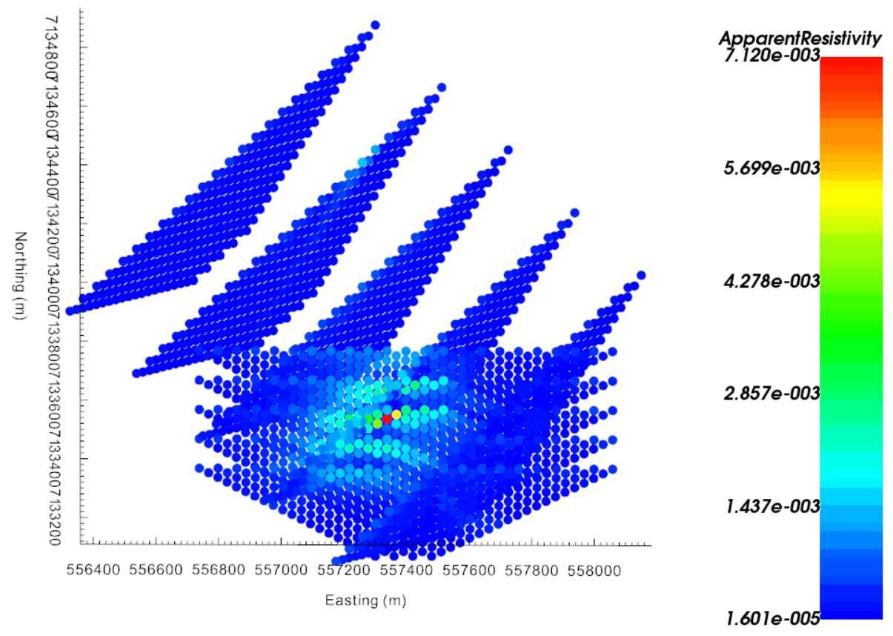

.. _AtoZDCIP_simulation:

.. include:: <isonum.txt>

Survey Design and Forward Simulation
====================================

Here, we show how to create a simple dipole-dipole DC Resistivity survey over
a conductivity model and run the forward simulation.

.. _AtoZdcip_setup:

Setup for the Exercise
----------------------

    - `Download the demo <https://github.com/ubcgif/GIFtoolsCookbook/raw/master/assets/AtoZ_DCIP_4Download.zip>`_
    - Open GIFtools
    - :ref:`Set the working directory <projSetWorkDir>`

.. tip:: - Requires at least ``GIFtools 2.26`` (login required)

Create Overlapping surveys
^^^^^^^^^^^^^^^^^^^^^^^^^^

In order to compare the resolving capabilities of different survey
configurations. Using the :ref:`DCIP Survey Designer <createSurveyDCIP>`, we
generate two survey blocks with the following parameters:

+-------------------+-----------------------+-----------------------+
|                   | Block 1               | Block 2               |
+-------------------+-----------------------+-----------------------+
| Survey Type       |   pole-dipole         | dipole-dipole         |
+-------------------+-----------------------+-----------------------+
| Dimension         |   3D                  | 3D                    |
+-------------------+-----------------------+-----------------------+
| Topography        | TKCtopo  (apply topo) | TKCtopo  (apply topo) |
+-------------------+-----------------------+-----------------------+
| Centroid          | 557250 E, 7134000 N   | 557400 E, 7133600 N   |
+-------------------+-----------------------+-----------------------+
| Bearing           | 45d                   | 90d                   |
+-------------------+-----------------------+-----------------------+
| Line Length       | 1500                  | 1500                  |
+-------------------+-----------------------+-----------------------+
| Line Spacing      | 300                   | 100                   |
+-------------------+-----------------------+-----------------------+
| Nb. lines         | 5                     | 5                     |
+-------------------+-----------------------+-----------------------+
| Electrode Spacing | 60                    | 60                    |
+-------------------+-----------------------+-----------------------+
| Nb. Receivers     | 20                    | 20                    |
+-------------------+-----------------------+-----------------------+

Merge the surveys
^^^^^^^^^^^^^^^^^

.. figure:: ./../../../images/AtoZ_DCIP/AtoZ_DC_survey.png
    :align: right
    :figwidth: 50%

- Since we are creating two separate surveys, the ``lineID`` assigned to Block 1 and 2 will be repeated. We will add a constant to the line ID so that they are all unique identifiers.
    - :ref:`Add constant value <objectConstantCalculator>` to Block 2 ``lineID`` property (+ 5)

- Select Block 1 and :ref:`combine block 2 <objectCombineData>` to form one large survey.
    - **Data Manipulation** |rarr| **Add Data** |rarr| **Merge other DCIP3D data**
    - Rename the combine object ``DCSurveyFull``

.. _AtoZdcip_Forward:

Forward model data
^^^^^^^^^^^^^^^^^^

- :ref:`Create a DC Forward <createDCIPFwd>` object
- :ref:`Edit input options <fwdEditOptions_dcip3d>`
    - Set ``Locations`` to ``DCSurveyFull``
    - Set ``Topography`` to ``TOPOdata`` and select ``TKCtopo``
    - Set ``Conductivity`` to ``TKC_condModel``
- :ref:`Write files <fwdWriteAll>`
    - Select ``Surface Data Format``
- :ref:`Run the forward simulation <fwdRun>`
- After completion, :ref:`Load the predicted data <fwdLoadResults>`

