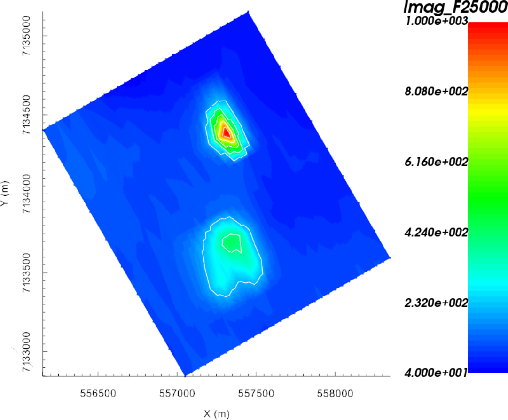
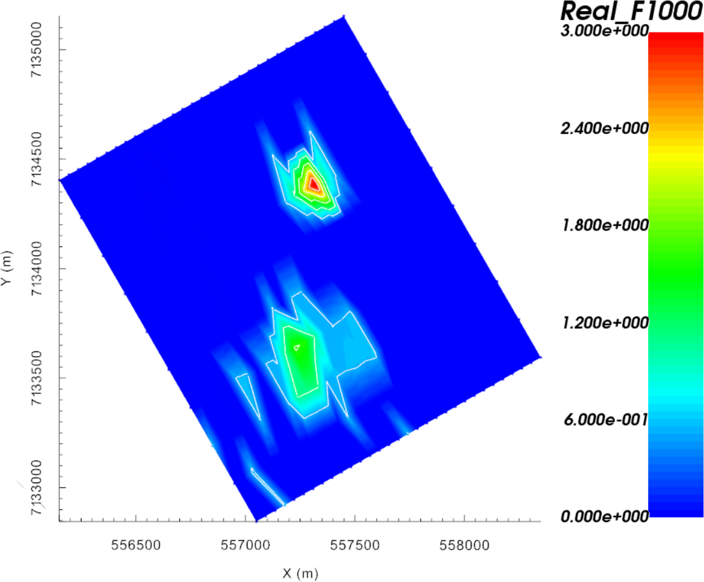
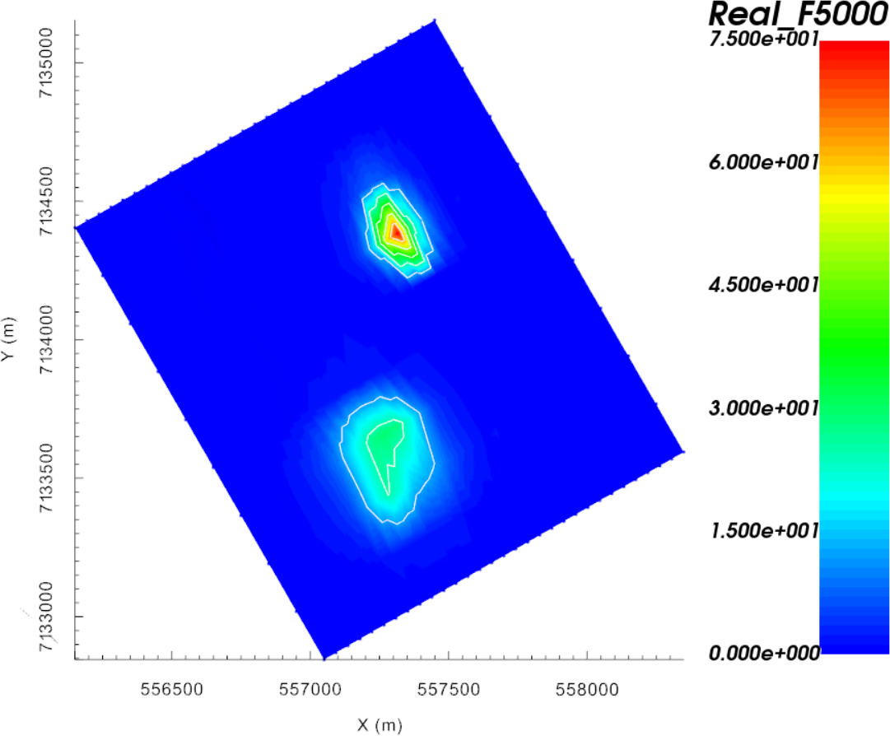
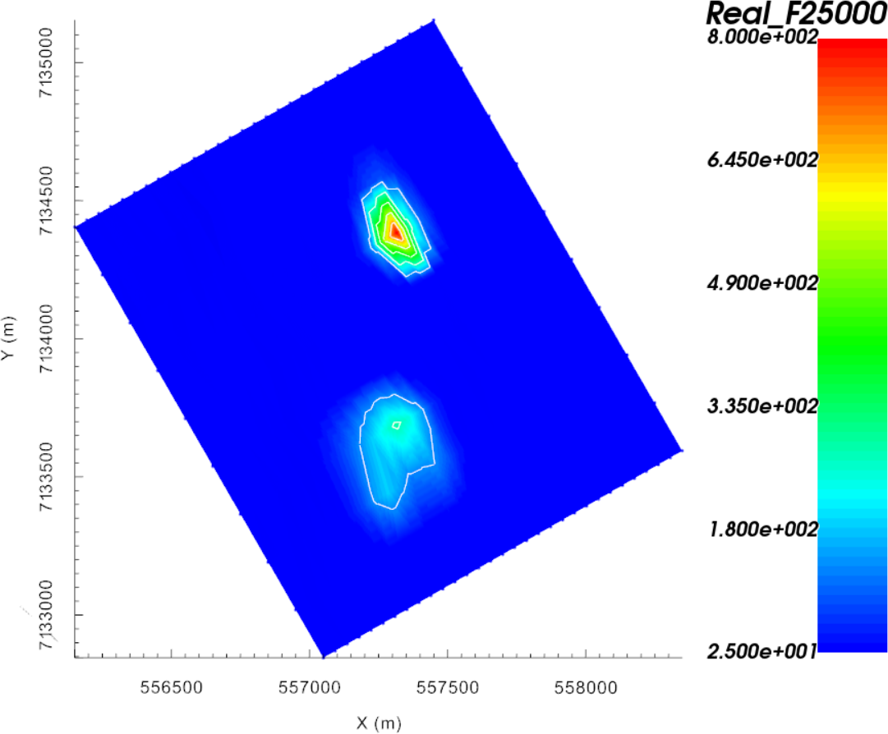

.. _AtoZe3d_data:

.. include:: <isonum.txt>

Specifying Parameters for FEM data
==================================

.. figure:: ./../../../images/AtoZ_fem1d/xyz_to_FEM.png
    :align: right
    :scale: 50%

Here, we detail the process of defining the survey parameters used in E3D
inversions.

    - Define the data columns being imported from a XYZ data file
    - Set transmitter, receiver and elevation information
    - Assign uncertainties to the data

.. _AtoZe3d_setup:

Setup for the Exercise
----------------------

    - `Download the demo <https://github.com/ubcgif/GIFtoolsCookbook/raw/master/assets/AtoZ_FEM1D_4Download.zip>`_
    - Open GIFtools
    - :ref:`Set the working directory <projSetWorkDir>`

.. tip:: - Steps (without links) are also included with the download
         - Requires at least `GIFtools version 2.27 <https://gif.eos.ubc.ca/GIFtools/downloads2>`_ (login required)

.. _AtoZe3d_import:

Import files
------------

In addition to raw geophysical data, you may have access to topographical information. If this information is available, it can be imported into GIFtools.

    - :ref:`Import raw FEM data <importFemData>` (XYZ format as an FEMsounding).
    - :ref:`Import topography data <importTopo>` (3D GIF format)

.. tip:: - Use **Edit** |rarr| **Rename** to change what objects in GIFtools are called
         - For any data object, :ref:`edit the data headers <objectDataHeaders>`.
         - Raw data were generated synthetically using the best-available conductivity model for TKC and the E3Doctree code.
         - The standard deviation of Gaussian noise added was determined from the uncertainties used to invert real FEM data collected over TKC.

Add Transmitter and Elevation Information
-----------------------------------------

.. figure:: ./../../../images/AtoZ_fem1d/create_FEM_Tx_Rx.png
    :align: right
    :scale: 50%

Since the raw data were formatted according to the XYZ format, the transmitter information for the airborne survey must be set manually. Additionally, only an altitude column was provided in the raw data. Therefore, we must use the topography and altitude information to determine the elevation of each data point.

    - :ref:`Create elevation from surface topography<objectElevFromSurface>`

        - Click **at surface** and use the altitude data column from the FEMsounding object
        - :ref:`Set i/o header<objectSetioHeaders>` for Z to the elevation column you just created

    - :ref:`Add transmitters<objectEMaddTx>` to set the locations of the transmitters **relative to the current xyz data locations**. Use the following parameters:

        - Dipole moment = 1 Am :math:`\! ^2`
        - Set Rotation angle as "Relative to bearing" and set bearing to calculate
        - Along-line offset = 0 m
        - Cross-line offset = 0 m
        - Set vertical offset as altitude column from data object

Convert ppm to Total field
--------------------------

As for many Frequency-domain systems, the data has been provided in *parts-
per-million* (ppm) of the primary field :math:`\mathbf{B}_{P}`. Before
inverting the data, field measurements must be converted to total field values
such that:

.. math::
    \mathbf{B}_{T}^{R} &= \mathbf{B}_{ppm}^{R} * \mathbf{B}_{P}^{R} * 10^{-6} + \mathbf{B}_{P}^{R} \\
    \mathbf{B}_{T}^{I} &= \mathbf{B}_{ppm}^{I} * \mathbf{B}_{P}^{R} * 10^{-6} \\

where :math:`\mathbf{B}_{T}^{R}` and :math:`\mathbf{B}_{T}^{I}` denote the
*Real* and *Imaginary* component of the total magnetic field. To proceed with
the transformation we need a value for the primary field
:math:`\mathbf{B}_{P}^{R}` (*Real*). Two options are in theory possible:

    (a) Compute the theoretical :math:`\mathbf{B}_{P}` for the given transmitter-receiver separation and frequencies,
    (b) Compute the free-space response numerically for a given mesh.

We will proceed with the second option as the numerical errors are generally
much larger than the secondary field response and can vary spatially.

Step 1: Create a mesh
^^^^^^^^^^^^^^^^^^^^^

We first need to generate a mesh that will also be used for the inversion.

Step 2: Forward modeling
^^^^^^^^^^^^^^^^^^^^^^^^

Step 3: Data conversion
^^^^^^^^^^^^^^^^^^^^^^^

.. .. raw:: html
..     :file: ./AtoZ_Data_Real.html

.. .. raw:: html
..     :file: ./AtoZ_Data_Imag.html

.. _AtoZe3d_uncert_assign:

Assign Uncertainties
--------------------

Before inverting the data, we must assign uncertainties. The role of uncertainties in the inversion process is described in the :ref:`inversion fundamentals section<Fundamentals_Uncertainties>`. Because real and imaginary components of the observed response each span different magnitudes, and the errors on the data may vary as such, distinct floor and percent uncertainties will be computed for each frequency.

    - Use :ref:`assign frequency-dependent uncertainties<objectAssignUncert>` to create data columns containing the data uncertainties. Use the following floor and percent values for both the real and imaginary data:

        - 1000 Hz = 1 ppm floor + 0\%
        - 5000 Hz = 2 ppm floor + 0\%
        - 25000 Hz = 5 ppm floor + 0\%

    - Set :ref:`i/o headers<objectSetioHeaders>` for all fields. Files used in the inversion cannot be written until this is performed.

.. note::
    The uncertainties for this exercise are the same as the uncertainties used to invert real FEM data collected over TKC. If the applied uncertainties are correct:
        - The recovered model will not fit the data too heavily in certain regions at the expense of others
        - The recovered model will not fit the data too heavily at certain frequencies at the expense of others
        - the recovered model will fit the real and imaginary components of the data equally

