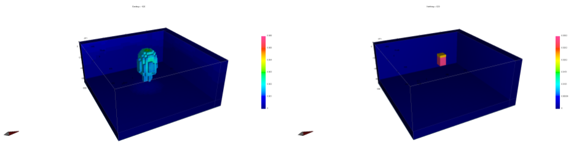

.. _AtoZNorms:

Lp and Lq Norms
===============

.. math::
    \phi_m(\mathbf{m}) = \phi_{small}(\mathbf{m}) + \phi_{smooth}(\mathbf{m})
    :label: Regularizer4

With:

.. math::
    \phi_{small}(\mathbf{m}) = \alpha_s ||W_s(\mathbf{m}-\mathbf{m}_0)||^p
    :label: Smallness4

And:

.. math::
    \phi_{smooth}(\mathbf{m}) =  \alpha_x ||W_x G_x(\mathbf{m}-\mathbf{m}_0)||^q + \alpha_y ||W_y G_y(\mathbf{m}-\mathbf{m}_0)||^q + \alpha_z ||W_z G_z(\mathbf{m}-\mathbf{m}_0)||^q
    :label: Smoothness4

Introduced in v6 of the gravity and magnetics codes and available in the EM1DTM code, it is now possible to change the norms in the different part of the regularization.

In the smallness term of the regularizer, the difference between the recovered model and the reference model is calculated at each iteration. The metric that is used can be defined as the sum of the difference (L1), or the sum of the squares of the difference (L2), or some other exponent of the difference. The user-definable exponent is referred to as Lp. For values between 0 and 2, a high value results in smoothly varying models and a low value allows for sparse models.

Similarly, the exponents relating to the gradients in x, y and z are definable through the Lq parameter. For values between 0 and 2, a high value enforces smooth gradients and a low value allows discontinuous gradients, resulting in blocky models.

Most codes thus far have involved the L2 (p=q=2) norm (which is a “sum of squares” style of norm), which favors smoothness. The choice of model norm style is based upon prior knowledge. For example, it makes sense to look for simple smooth models when there is no knowledge about subsurface structures. In contrast, the L0 or L1 norm has some different characteristics: it makes blocky models, and outliers are less influential.

