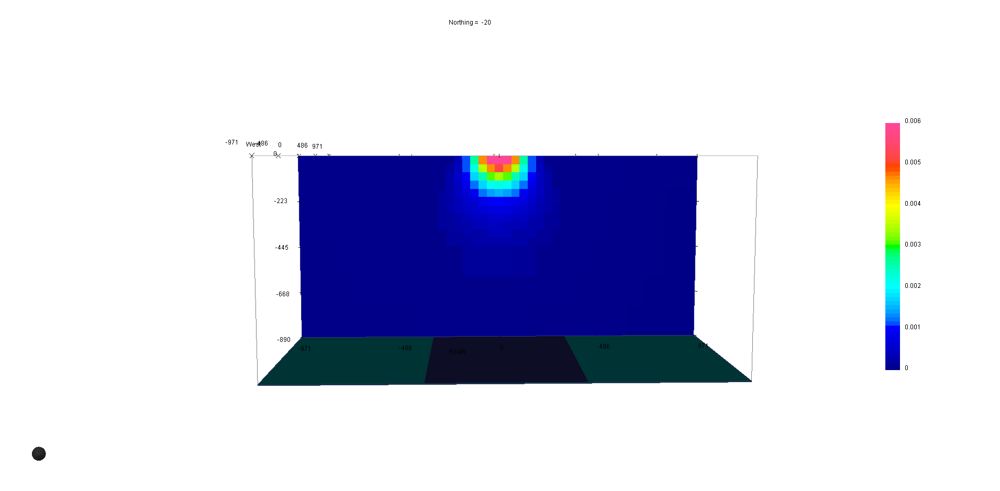
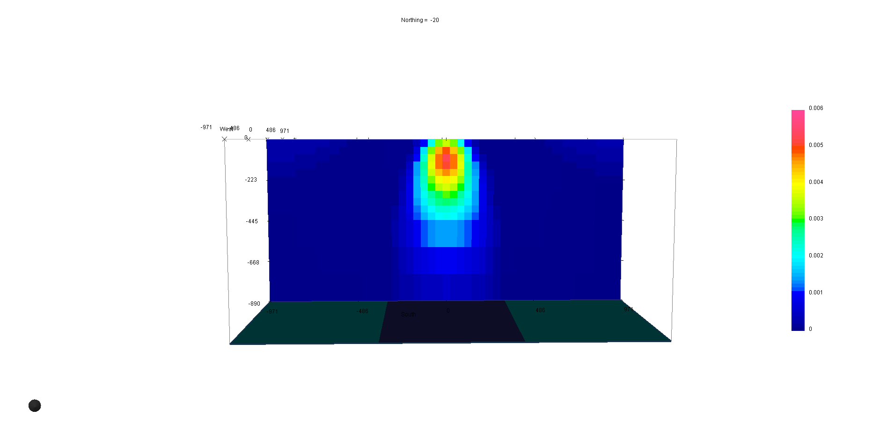

.. _AtoZWeightingMatrix:

The Weighting Matrices W
========================

Cell-based weighting matrices are used to enforce any a priori information
available about the distribution of model parameters and their gradients. For
potential field problems, these matrices also hold a :ref:`depth or distance<AtoZDepthDistMatrix>` weighting function to counteract the rapid decay in
sensitivities.

.. math::
    \phi_m(\mathbf{m}) = &{\alpha_s} ||\mathbf{\color{blue}W_s}\;\mathbf{R}_s(\mathbf{m}-\mathbf{m}_{ref})||_2^2 +\\
    &{\alpha_x} ||\mathbf{\color{blue}W_x}\;\mathbf{R}_x \; \mathbf{G}_x(\mathbf{m}-\mathbf{m}_{ref})||_2^2 +\\
    &{\alpha_y} ||\mathbf{\color{blue}W_y}\;\mathbf{R}_y \; \mathbf{G}_y(\mathbf{m}-\mathbf{m}_{ref})||_2^2 +\\
    &{\alpha_z} ||\mathbf{\color{blue}W_z}\;\mathbf{R}_z \; \mathbf{G}_z(\mathbf{m}-\mathbf{m}_{ref})||_2^2
    :label: Regularizer_w

The smallness matrix Ws
-----------------------
The relative closeness of the final model to the reference model at any location is controlled by the :math:`W_s` model. If the interpreter has high confidence in the reference model at a particular region, they can specify increased amplitude there compared to other regions of the model. The format of :math:`W_s` is a standard UBC 3D model. The default values are 1, giving equal confidence for all cells in the reference model. With GIFTools users can create weights from geology model in GIFtools (see :ref:`Create weights from a geologic model<weightsFromGeoModel>` ).

The smoothness matrices Wx, Wy and Wz
-------------------------------------
The weighting functions :math:`W_x`, :math:`W_y` and :math:`W_z` can be designed to enhance or attenuate gradients at various regions in the model. If geology suggests a rapid transition in the model, then a decreased weighting on particular derivatives of the model will allow for higher gradients there and thus provide a more geologic model that fits the data.
:math:`W_x`, :math:`W_y` and :math:`W_z` are defined on the faces of each cell. The default values are 1 for all faces. Values less than 1 allow for breaks in the model, while values greater than one forces continuity across cell faces.
Face-weighting can be performed in GIFtools. The UBC utility make_wdat.exe creates a face weights file that has layers of terrain-draped cells, where wx and wy are modified to force continuity in those directions. This can reduce near-surface artefacts, e.g. near electrodes.

.. _AtoZDepthDistMatrix:

Depth or Distance Weighting
---------------------------
The most common use of the weighting matrices is to define a depth or distance weigthing. The sensitivity of signal decays predominantly as a function of depth (for surface/airborne data). The rate of signal decay depends on the type of signal being modelled. Depth weighting takes this decay into account, ensuring that the inversion does not preferentially change cells at any one particular depth.
Unlike depth weighting, distance weighting weights the sensitivity of the model based on the radial distance from the observation to each cell, not just the depth. This is useful when inverting down-hole data, or data that is collected on highly irregular surfaces including extreme topography or rough airborne drapes.

See for examples the :ref:`Gravity inversion<AtoZGrav_Inversion>` or :ref:`Magnetic inversion <AtoZMag_Susc>`.

.. raw:: html
    :file: ./raw/AtoZ_InvFun_DepthW.html

