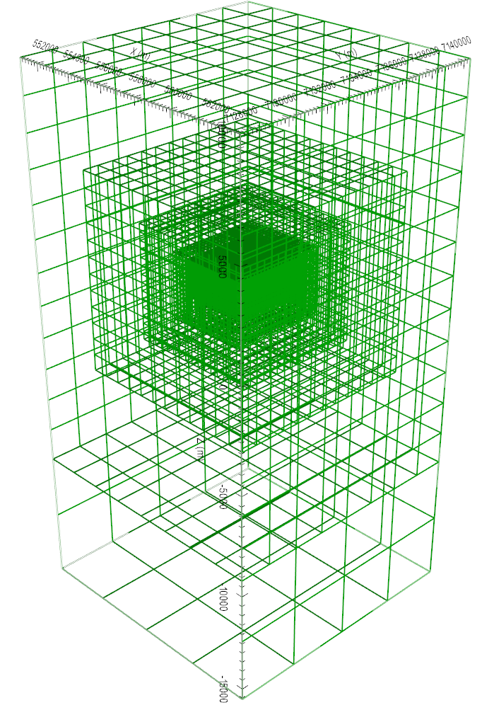

.. _AtoZNS_data:

.. include:: <isonum.txt>

Importing, Interpreting and Preparing NSEM Data
===============================================

For this exercise, we:

	- Import impedance tensor data in EMAP standard format from a set of EDI files
	- Perform basic interpretation of the data through impedances and apparent resistivities
	- Apply uncertainties for use in the inversion

Setup for the Exercise
----------------------

	- Download the demo (**pending**)
	- Open GIFtools
	- :ref:`Set the working directory <projSetWorkDir>`

.. important:: Requires GIFtools v2.25 or later.

Import Files
------------

	- :ref:`Import impedance data from EDI files <importNSEMData_edi>` in sub-folder *MTdataEDI*. Data are in standard EDI format (Northing-Easting-Down), which is also used by GIF codes.
	- Ensure that :ref:`IO headers are set <objectSetioHeaders>` for all impedance data.

.. note:: In this case, MT data are in a widely used coordinate system which matches that of the GIF codes. If a non-standard coordinate system is being used in the EDI files, it is imperative the user transform the data to GIF within GIFtools before inverting. This can be done by :ref:`changing data headers <objectDataHeaders>`, :ref:`multiplying certain columns by -1 <objectConstantCalculator>` and/or :ref:`re-setting io Headers <objectSetioHeaders>`.

Interpreting the data
---------------------

By examining the impedances, apparent resistivities and phases, we can determine if the units of the data are correct and whether the data are in GIF format.

	- Use VTK to image the off-axis impedance tensor elements :math:`Z_{xy}` and :math:`Z_{yx}`. Notice that:

		- :math:`Z_{xy}` data are in the lower-righthand corner of the complex plane :math:`Z_{yx}` data are in the upper-lefthand corner of the complex plane
		- This is consistent with data that is in :ref:`GIFtools format <sign_mt_conv>`

	- :ref:`Convert impedances to apparent resistivity and phase <objectDataManipulationMT_IMP2APP>`

	- Use VTK to image the apparent resistivities derived from the off-axis impedance tensor elements (image on log-scale). Notice that:

		- The resistivity of the background geology is :math:`\sim 10^4 \; \Omega m`
		- The DO-27 and DO-18 pipes show up as conductors (:math:`\rho_a \sim 10^2 \, \Omega m`)

.. figure:: ../../../images/AtoZ_E3DMT/data_impedance.png
    :align: center
    :width: 700

    Real (left) and imaginary (right) components of impedance tensor element :math:`Z_{xy}` at 2500 Hz in V/A. Data shows that :math:`Z_{xy}` lies in the lower-righthand quadrant of the complext plane. This is consistent with the desired format in GIFtools.

.. figure:: ../../../images/AtoZ_E3DMT/data_appres.png
    :align: center
    :width: 700

    Apparent resistivities for :math:`Z_{xy}` at frequencies 2500 Hz (left) and 10000 Hz (right). Apparent resistivity data shows the DO-27 and DO-18 anomalies as conductors.

Creating an OcTree mesh
-----------------------

	- :ref:`Create an E3DMT mesh utility <createE3DMToctreeMesh>` using the MT survey object and create a directory for any output files.
	- Select the newly created object (E3DMT mesh utility) and :ref:`set NSEM data <utilSetData>`
	- :ref:`Edit options <utilEditOptions_E3DMT>`. Use the following parameters:

		- Background resistivity: 10,000 :math:`\Omega m`
		- Topography: set as 425 m and select *Approximate topography* button
		- East width = 50 m, North width = 50 m, Thickness = 50 m
		- RX cells 1 = 8, RX cells 2 = 4 and RX cells 3 = 2
		- DOI 1 = 500, DOI 2 = 1000, DOI 3 = 2000
		- East padding = 5000 m, North padding = 5000 m, Down padding = 5000 m, Air padding = 7600 m

	- :ref:`Run the utility <utilRun>`
	- :ref:`Load results <utilLoadResults>`
	- :ref:`Create active model from GIF model <objectFunctionalityModCreateActive>`. The GIF model should have the name *active_cells_topo*.

    OcTree mesh. 75,168 total cells.

.. important:: For this example, mesh parameters were set such that we had flat topography which did not intersect any padding cells. In practice, we must ensure the topography is sufficiently discretized. Otherwise, source terms computed in the code are not accurate. This will lead to artifacts in the inversion even if the padding distance is sufficient. A good way check is to look at the active cells model.

.. important:: By choosing flat topography, we have ensure all measurements are exactly on the surface of the discretized topography. If topography is used, the data locations must be projected onto the discretized topography.

Adding Uncertainties
--------------------

Assigning appropriate uncertainties to the data is necessary for running stable and successful inversions with GIFtools. For this exercise, data were generated synthetically, no noise was added and we apply simple uncertainties.

	- Use :ref:`assign simple uncertainties <objectAssignUncert>` to generate uncertainties for the data. For diagonal impedance tensor elements, only a floor uncertainty of 0.1 V/A was used. For off-diagonal impedance tensor elements, only a 5% uncertainty was used.
	- Ensure that :ref:`IO headers are set <objectSetioHeaders>` for all uncertainties.

.. important:: To demonstrate the E3DMT codes, we have chosen to apply simple uncertainties. In practice, we must ensure that we do not overfit certain frequencies and locations at the expense of others. Furthermore, we must not overfit the diagonal impedance tensor elements as the most important information is contained in the off-diagonal elements.

