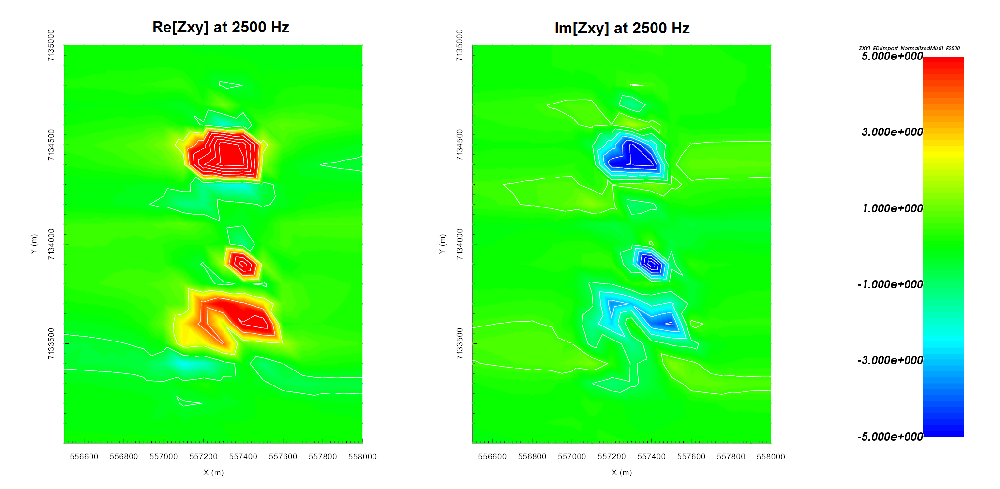
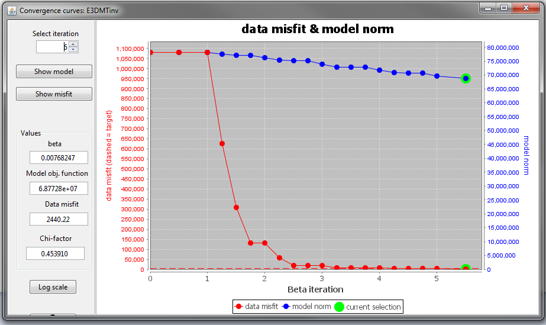
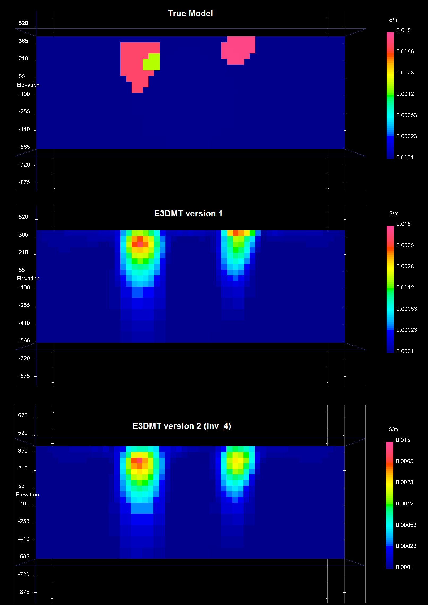

.. _AtoZNS_inversion:

.. include:: <isonum.txt>

Inverting MT Data
=================

Here, we invert synthetic impedance tensor data using E3DMT versions 1 and 2.
The goal is to provide strategies for successful inversion and show that both codes can be used to recover TKC.
When inverting impedances, the E3DMT codes have a tendency to place conductive artifacts proximal to the receivers.
To overcome this obstacle, we demonstrate a basic approach for limiting artifacts through the use of interface weights.

.. _AtoZNS_inversion_setup:

Setup for the Exercise
----------------------

**If you have completed the tutorial** :ref:`"Importing, Interpreting and Preparing NSEM Data"<AtoZNS_data>`:

    - Open your preexisting GIFtools project
    - :ref:`Set the working directory <projSetWorkDir>` (if you would like to change it)

**If you have NOT completed the previous tutorial and would like to start here, complete the following steps:**

    - Download the demo (**pending**)
    - Open GIFtools
    - :ref:`Set the working directory <projSetWorkDir>`
    - :ref:`Import the observed data in E3DMT version 1 format: assets\\MT_ZTEM_data.obs <importNSEMData_e3dmt1>` (Impedance tensor data in V/A)
    - :ref:`Load OcTree mesh <importMeshOctree>`
    - :ref:`Load active cells model <importActiveModel>`

.. figure:: ../../../images/AtoZ_E3DMT/data_impedance.png
    :align: center
    :width: 700

    Real (left) and imaginary (right) components of impedance tensor element :math:`Z_{xy}` at 2500 Hz in V/A. Data shows that :math:`Z_{xy}` lies in the lower-righthand quadrant of the complex plane. This is consistent with the desired format in GIFtools.

.. figure:: ../../../images/AtoZ_E3DMT/data_appres.png
    :align: center
    :width: 700

    Apparent resistivities for :math:`Z_{xy}` at frequencies 2500 Hz (left) and 10000 Hz (right). Apparent resistivity data shows the DO-27 and DO-18 anomalies as conductors. Apparent resistivity data can be created from impedance data using GIFtools.

.. important:: Data were generated using E3DMT version 1 and an interpolation of the best conductivity model for TKC. To keep things simple, the synthetic model was given a constant topography of 425 m. Uncertainties of 0.1 V/A were added to diagonal impedance tensor elements and uncertainties of 5% were added to off-diagonal elements.

Reducing Artifacts through Interface Weighting
----------------------------------------------

When inverting MT data, the E3DMT codes have a tendency to place conductive structures near receiver locations due to the sensitivity of the data to those cells. Here, we generate interface weights to counteract this problem. By forcing lateral smoothness within the top few layers of cells, we can limit the artifacts and force the inversion to place conductive structures at the appropriate depths.

    - :ref:`Create and interface weights utility <createinterfWeights>`
    - Use :ref:`edit options <utilEditOptions>` and set the following parameters:

        - set the OcTree mesh
        - set as *log model*
        - set topography as the active cells model
        - set 5 layers of surface weights with values 35, 20, 8, 3 in decreasing order
        - Face value = 0.0001
        - Face tolerance = 0.0001

    - :ref:`Run the utility <utilRun>`
    - :ref:`Load results <utilLoadResults>`

E3DMT Version 1
---------------

Let us now invert the impedance tensor data using E3DMT version 1. 

    - :ref:`Create E3DMT ver 1 inversion object <createMTZTEMInv>`
    - :ref:`Use edit options <invEditOptions_e3dmt_ver1>` to set the inversion parameters

        - Basic Tab:
            - Select the impedance data
            - Set mesh
            - Set topography to active cells model
            - No background susceptibility
            - 1D conductivity of 0.0001 S/m (which we inferred from apparent resistivity maps)
            - Use *Iterative* solver unless you have sufficient RAM to use *Direct* solver.

        - Model Options Tab:
            - Set *Chi Factor* = 1.
            - *alpha S* = 0.0001, *alpha E* = 1, *alpha N* = 1 and *alpha Z* = 10 (to emphasize some vertical smoothness)
            - Use the weights object to add additional weights
            - Set the *active cells topo* as the active model cells
            - Set initial model as 0.0001 S/m
            - Set upper bound as 1 S/m and lower bound as 0.00001 S/m
            - Set reference model as 0.0001 S/m

    - Click *Apply and write files*
    - :ref:`Run the inversion <invRun>`
    - :ref:`Load results <invLoadResults>`
    - :ref:`View convergence <convergence_curve>`

The results of the inversion are shown below. The convergence curve indicates that the inversion reaches target misfit after 3 iterations. When comparing the true model and recovered model, we see that the inversion recovers the both the DO-27 and DO-18 kimberlite pipes. Surface weighting was able to limit near surface artifacts. However, the recovered model has a slightly lower conductivity than the true model. Given that the starting and reference models are a 0.0001 S/m halfspace, it is possible the uncertainties on the data are too large. When examining the normalized misfit, we see that locations over the pipes are not fit nearly as well as the background. Essentially, we are overfitting the background at the expense of the pipes and we should consider re-inverting with a better set of uncertainties.

    Convergence curve shows that inversion reaches target misfit.

    True model (top) and recovered model at Easting = 557300 m.

    Normalized misfit for the real component of :math:`Z{xy}` (left) and the imaginary component of :math:`Z{xy}` (right) at 2500 Hz.

E3DMT Version 2
---------------

Let us now invert the impedance tensor data using E3DMT version 2. Unlike version 1, version 2 requires that user define the receiver which measure the fields.

    - Click the impedance data object and :ref:`set receivers from locations <objectDataTypeMT_snid>`. Use the following values:

        - Easting width = 1 m
        - Northing width = 1 m
        - Vertical width = 1 m
        - Dipole length = 1 m

    - :ref:`Create E3DMT ver 2 inversion object <createMTZTEMInv>`
    - :ref:`Use edit options <invEditOptions_e3dmt_ver2>` to set the inversion parameters

        - Basic Tab:
            - Select the impedance data
            - Set mesh
            - Set topography to active cells model
            - No background susceptibility
            - 1D background conductivity of 0.0001 S/m (which we inferred from apparent resistivity maps).
            - Use *Iterative* solver unless you have sufficient RAM to use *Direct* solver.

        - Model Options Tab:
            - Set *Chi Factor* = 1.
            - *alpha S* = 0.0001, *alpha E* = 1, *alpha N* = 1 and *alpha Z* = 10 (to emphasize some vertical smoothness
            - Use the weights object to add additional weights
            - Set the *active cells topo* as the active model cells
            - Set initial model as 0.0001 S/m
            - Set upper bound as 1 S/m and lower bound as 0.000001 S/m
            - Set reference model as 0.0001 S/m

        - Inversion Parameters Tab:
            - Set *memory settings* as *write to file*

    - Click *Apply and write files*
    - :ref:`Run the inversion <invRun>`
    - :ref:`Load results <invLoadResults>`
    - :ref:`View convergence <convergence_curve>`

The final model recovered using E3DMT version 2 is shown below. As we can see, the inversion more or less converges after the 4th iteration. The DO-27 and DO-18 kimerlite pipes are recovered. However when comparing the final recovered models from E3DMT versions 1 and 2, we notice they are slightly different. This can be explained by the following:

    1. The measure of data misfit for both codes is different; see `E3DMT manual <https://e3dmt.readthedocs.io/en/manual_ver1/content/theory.html#data-misfit>`__ . Thus the optimization problem being solved at each beta and the target misfit are both different; which results in recovered models which are not identical.
    2. Because receivers are explicitly defined in E3DMT version 2, there is a difference in how both codes compute predicted data from the solution of the fields on cell edges. The impact of this should be more or less negligible if the receivers are sufficiently smaller than the cell size.

    Convergence curve shows that inversion more or less fits the data after the 4th iteration.

    True model (top), final recovered model using E3DMT version 1 and final recovered model at iteration 4 using E3DMT version 2 (bottom) at Easting = 557300 m.
