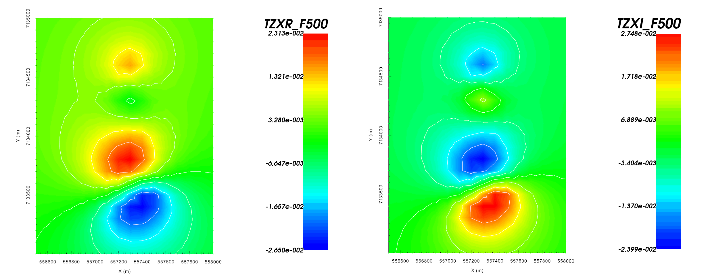

.. _AtoZNS_joint:

.. include:: <isonum.txt>

ZTEM and Joint Inversion
========================

Here, we explore GIFtools functionality that lets the user jointly invert multiple natural source datasets using E3DMT version 1.

.. _AtoZNS_joint_setup:

Setup for the Exercise
----------------------

**If you have completed the tutorial** :ref:`"Inverting MT data"<AtoZNS_inversion>`:

    - Open your preexisting GIFtools project
    - :ref:`Set the working directory <projSetWorkDir>` (if you would like to change it)

**If you have NOT completed the previous tutorial and would like to start here, complete the following steps:**

    - `Download the demo <https://github.com/ubcgif/GIFtoolsCookbook/raw/master/assets/AtoZ_FEM1D_4Download.zip>`_
    - Open GIFtools
    - :ref:`Set the working directory <projSetWorkDir>`
    - :ref:`Import the observed MT and ZTEM data in E3DMT version 1 format <importNSEMData_e3dmt1>` (Impedance tensor data in V/A)
    - :ref:`Load OcTree mesh <importMeshOctree>`
    - :ref:`Load active cells model <importActiveModel>`
    - :ref:`Load interface weights <importFaceWeights>` (cell weights are given a default value of 1)

.. figure:: ../../../images/AtoZ_E3DMT/data_impedance.png
    :align: center
    :width: 700

    Real (left) and imaginary (right) components of impedance tensor element :math:`Z_{xy}` at 5000 Hz in V/A. Data shows that :math:`Z_{xy}` lies in the lower-righthand quadrant of the complex plane. This is consistent with the desired format in GIFtools.

    Real (left) and imaginary (right) components of tipper :math:`T_{x}` at 5000 Hz. Data shows a much larger anomaly in conjunction with the DO-27 pipe.

.. important:: Data were generated using E3DMT version 1 and an interpolation of the best conductivity model for TKC. To keep things simple, the synthetic model was given a constant topography of 425 m. Uncertainties of 0.1 :math:`\pm` 10% were added to all impedance tensor measurements. And uncertainties of 0.001 :math:`\pm` 10% were added to all tipper measurements. Tipper data were collected at a flight height of 50 m.

ZTEM Inversion
--------------

Let us now invert the ZTEM data using E3DMT version 1. 

    - :ref:`Create E3DMT ver 1 inversion object <createMTZTEMInv>`
    - :ref:`Use edit options <invEditOptions_e3dmt_ver1>` to set the inversion parameters

        - Basic Tab:
            - Select the ZTEM data
            - Set mesh
            - Set topography to active cells model
            - No background susceptibility
            - 1D conductivity of 0.0001 S/m (which we inferred from apparent resistivity maps)
            - Use *Iterative* solver unless you have sufficient RAM to use *Direct* solver.

        - Model Options Tab:
            - Set *Chi Factor* = 1.
            - *alpha S* = 0.0001, *alpha E* = 1, *alpha N* = 1 and *alpha Z* = 10 (to emphasize some vertical smoothness)
            - Use the weights object to add additional weights
            - Set the *active cells topo* as the active model cells
            - Set initial model as 0.0001 S/m
            - Set upper bound as 1 S/m and lower bound as 0.000001 S/m
            - Set reference model as 0.0001 S/m

    - Click *Apply and write files*
    - :ref:`Run the inversion <invRun>`
    - :ref:`Load results <invLoadResults>`
    - :ref:`View convergence <convergence_curve>`

Joint MT-ZTEM Inversion
-----------------------

We will not jointly invert MT and ZTEM data to recover a single conductivity model for TKC.

- :ref:`Create E3DMT ver 1 inversion object <createMTZTEMInv>`
    - :ref:`Use edit options <invEditOptions_e3dmt_ver1>` to set the inversion parameters

        - Basic Tab:
            - Select **both** the impedance **and** ZTEM data.
            - Set mesh
            - Set topography to active cells model
            - No background susceptibility
            - 1D conductivity of 0.0001 S/m (which we inferred from apparent resistivity maps)
            - Use *Iterative* solver unless you have sufficient RAM to use *Direct* solver.

        - Model Options Tab:
            - Set *Chi Factor* = 1.
            - *alpha S* = 0.0001, *alpha E* = 1, *alpha N* = 1 and *alpha Z* = 10 (to emphasize some vertical smoothness)
            - Use the weights object to add additional weights
            - Set the *active cells topo* as the active model cells
            - Set initial model as 0.0001 S/m
            - Set upper bound as 1 S/m and lower bound as 0.000001 S/m
            - Set reference model as 0.0001 S/m

        - Inversion Parameters Tab:
            - Under *Data weighting for joint inversion* select *Weight by relative number of data*

    - Click *Apply and write files*
    - :ref:`Run the inversion <invRun>`
    - :ref:`Load results <invLoadResults>`
    - :ref:`View convergence <convergence_curve>`

