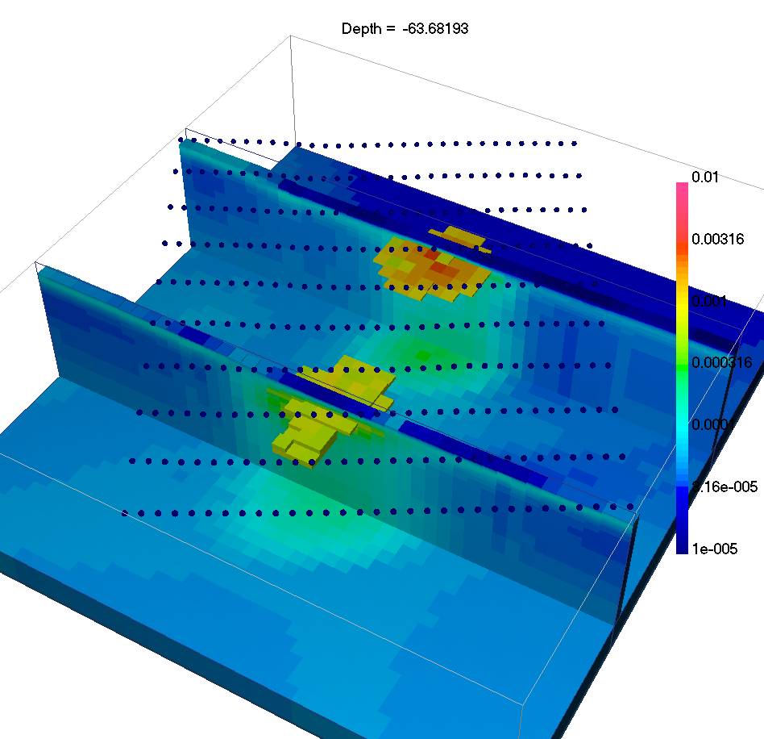
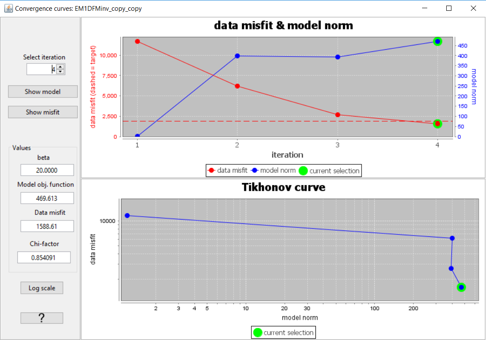
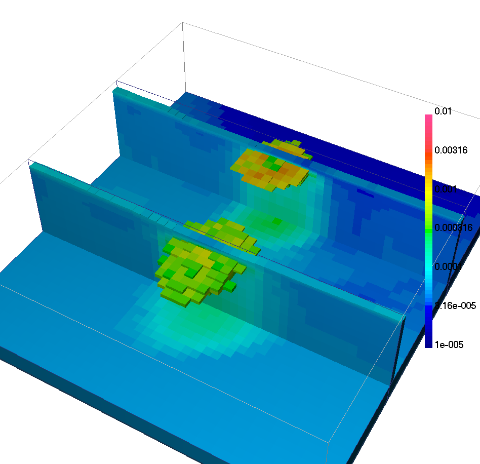
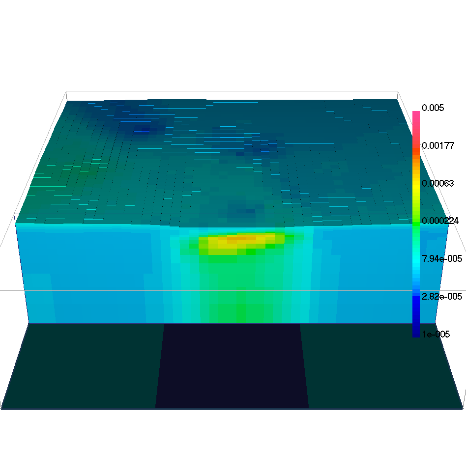
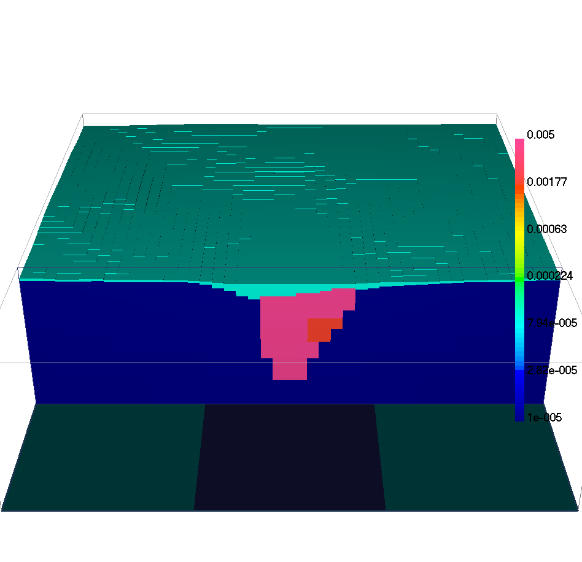

.. _AtoZem1dfm_lateral:

.. include:: <isonum.txt>

Laterally Constrained 3D Inversion
==================================

Here, frequency-domain data are inverted using the laterally constrained 3D
inversion approach. Just like in the previous exercise, every 1D model is
associated with a distinct sounding location (see `EM1DFM package overview
<http://em1dfm.readthedocs.io/en/latest/content/overview.html>`__). However
lateral constraints are added such that the set of recovered 1D models are
smooth horizontally and can ultimately be constrained and interpreted in 3D.
The laterally constrained 3D inversion algorithm is a computationally fast way
to invert FEM data while taking into account both vertical and horizontal
variability of the Earth. The final model recovered by this algorithm is fully
3-dimensional.

.. figure:: ../../../images/AtoZ_fem1d/AtoZ_EM1DFM_landing_LC.png
    :align: center
    :figwidth: 75%

As part of this exercise, the user will:

    - :ref:`Set<AtoZem1dfm_lateral_setup>` relevant inversion parameters
    - :ref:`Invert<AtoZem1dfm_lateral_inversion>` the field observations using a set of laterally constrained 1D conductivity models (susceptibility models can be included)
    - :ref:`Interpret<AtoZem1dfm_lateral_discussion>` the inversion results generated by the algorithm

.. _AtoZem1dfm_lateral_setup:

Setup for the Exercise
----------------------

**If you have completed the tutorial** :ref:`"Static and Adaptive 1D Inversion"<AtoZem1dfm_static>`:

    - Open your preexisting GIFtools project
    - :ref:`Set the working directory <projSetWorkDir>` (if you would like to change it)

**If you have NOT completed the previous tutorial and would like to start here, complete the following steps:**

    - `Download the demo <https://github.com/ubcgif/GIFtoolsCookbook/raw/master/assets/AtoZ_FEM1D_4Download.zip>`_
    - Open GIFtools
    - :ref:`Set the working directory <projSetWorkDir>`
    - :ref:`Import em1dfm data file: Assets//FEM1D.obs <importFemData>` (1D FEM GIF format data in ppm)
    - :ref:`Import 1D mesh<importMesh>` (layers file)
    - :ref:`Import the topography data <importTopo>` (3D GIF format)
    - :ref:`Create elevation from surface topography<objectElevFromSurface>`
        - Set elevation at 40 m above topography
        - :ref:`Set i/o header<objectSetioHeaders>` for Z to the elevation column you just created.

.. note:: Uncertainties were ascertained experimentally by running a multitude of inversions and examining the final normalized data misfits in each case.

.. raw:: html
    :file: ./AtoZ_Data_Real.html

.. raw:: html
    :file: ./AtoZ_Data_Imag.html

*Real (left) and quadrature (right) components of synthetic FEM data collected over TKC*

.. _AtoZem1dfm_lateral_inversion:

Laterally Constrained 3D FEM Inversion
--------------------------------------

.. figure:: ./../../../images/AtoZ_fem1d/LC_fem1D.png
    :align: right
    :scale: 75%

Here, the set of FEM data are inverted using the laterally constrained 3D
approach.

Setup the inversion
^^^^^^^^^^^^^^^^^^^

**If you have completed the tutorial** :ref:`"Static and Adaptive 1D Inversion"<AtoZem1dfm_static>`:

    - Click on a preexisting EM1DFM inversion object and :ref:`copy options<invCopyOptions>`
    - Click on the newly created EM1DFM inversion object to set the output directory
    - Set any necessary EM1DFM inversion parameters under :ref:`edit options<invEditOptions>`:
        - Make sure the mesh, observed data and topography are properly set!
        - Mode: Laterally constrained 3D
            - *Max distance* = 1000 m
            - *Number of stations* = 10
            - *Smoothing parameter* = 10
            - Other parameters left as default values
        - Use the *Fix Trade-off* mode
            - *Initial beta* = 2000
            - *Cooling factor* = 10
            - Other parameters left as default values

**If you have NOT completed the previous tutorial and are starting here:**

    - :ref:`Create an EM1DFM inversion object <createFEMInv>` and set the output directory
    - Set the EM1DFM inversion parameters under :ref:`edit options<invEditOptions>` using the parameters specified in the bullet list above

.. note:: If you chose not to write the files from the edit options menu, you may do so through :ref:`write inversion files <invWriteAll>`

Run Inversion and Load Results
^^^^^^^^^^^^^^^^^^^^^^^^^^^^^^

    - :ref:`Run inversion <invRun>`
    - Results are loaded automatically for this algorithm
    - :reF:`View the misfit map <viewData>`

.. _AtoZem1dfm_lateral_discussion:

Discussion
^^^^^^^^^^

    Recovered 1D models with topography and lateral constraints

The lateral constraints strategy comes with many advantages:

    - Neighboring 1D conductivity models are more consistent
    - Conductivity structures are interpolated in 3D, possibly highlighting trends in the model and easing the interpretation.
    - Possible to employ a :math:`\beta`-cooling strategy similar to the 3D inversion code.

The use of a global measure of data fit allows us to assess the convergence of
the algorithm through the usual :ref:`convergence curve<convergence_curve>` window.

    Convergence curves

Ideally we would like to test the hypothesis of a conductive overburden in 3D, as well as to impose bounds on the conductivity values.
which we covered in the :ref:`next section<AtoZem1dfm_lateral>`.

.. _AtoZem1dfm_lateral_constr:

Geological Constraints: Hypothesis Testing
------------------------------------------

It is well known that at TKC, there is a till overburden covering a portion of the survey area.
As a final example we will impose 3D geological constraints on the laterally constrained 1D inversions.
The geological constraints assume we have some a-priori information about the distribution and thickness of the overlying till.
To apply geological constraints, we first need to create the reference conductivity model from a surface:

Creating a Reference Model
^^^^^^^^^^^^^^^^^^^^^^^^^^

Here, we use surface topography and a surface object to define the upper and lower surfaces of the till layer, respectively.
We then assign reasonable physical property values for the till and background.
To accomplish this task, we use the model builder module.

    - :ref:`Import the surface<importSurface>` file provided (TillLayer.topo)
    - Select one of the 3D mesh objects created from a previous inversion and :ref:`create active model from topography<createActiveCellsModel>`. Use *from tops of cells*.
    - Select the active cells model and :ref:`create a model builder module<createModelBuilder>`
    - From ModelBuilder -> Create Model
        - Using surface
            - Populate values
                - Assign :math:`10^{-4}` S\\m
    - Change model values for the basement
        - Model->Edit
            - Replace value
                - Old value: 0
                - New value: :math:`10^{-5}` S\\m

We can now use this physical property model to define surface weights in order
to encourage large gradients at the bottom of the till layer.

    .. figure:: ./../../../images/AtoZ_fem1d/TillWeights.png
        :align: right
        :scale: 10%

    - From ModelBuilder -> Build Constraints
        - Weighting functions
            - From only a geological model
                - Face weights (Weight value = 100)

.. figure:: ./../../../images/AtoZ_fem1d/AtoZ_fem_TillModel.png
    :align: right
    :figwidth: 45%

    Physical property model built from till surface layer.

Setup the inversion
^^^^^^^^^^^^^^^^^^^

    .. figure:: ./../../../images/AtoZ_fem1d/Inv_LC_inp.png
        :align: right
        :scale: 10%

    - Click on a preexisting EM1DFM inversion object and :ref:`copy options<invCopyOptions>`
    - Select GIFweight object
    - Select lower bound model

Run Inversion and Load Results
^^^^^^^^^^^^^^^^^^^^^^^^^^^^^^

    - :ref:`Run inversion <invRun>`
    - Results are loaded automatically for this algorithm
    - :reF:`View the misfit map <viewData>`

Discussion
^^^^^^^^^^

    Recovered 1D models with geological constraints

This final solution differs from the previous inversion such that:
    - A sharp gradient is preserved along the base of the till layer
    - The upper conductivities are more consistent :math:`\approx 10^4 \Omega \cdot m`
    - The top of the kimberlite pipes is at the right depth, and the compact shape of the pipes is better preserved

    EW section through the constrained 1D inversion

    EW section through the true 3D conductivity model

