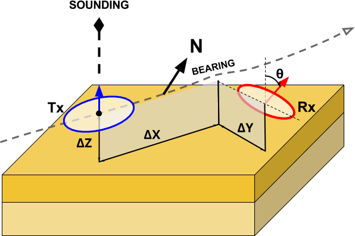
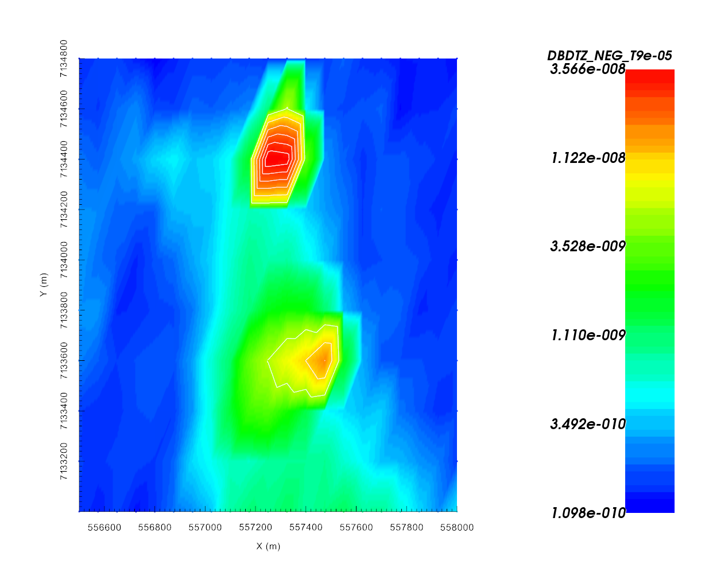
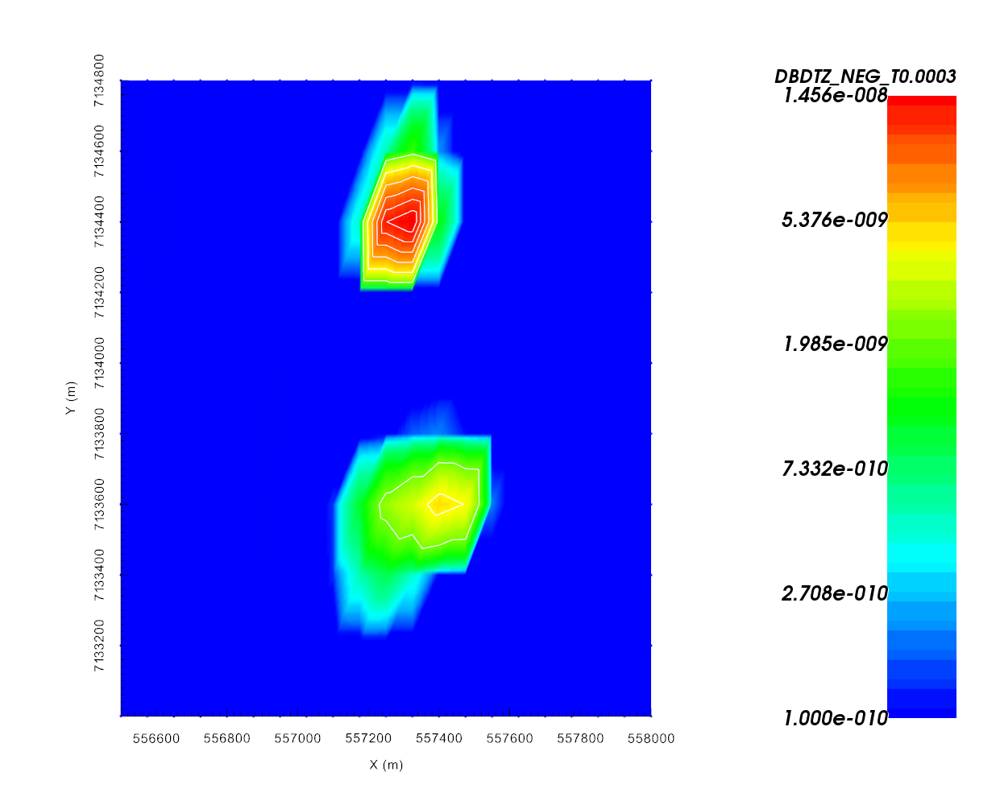
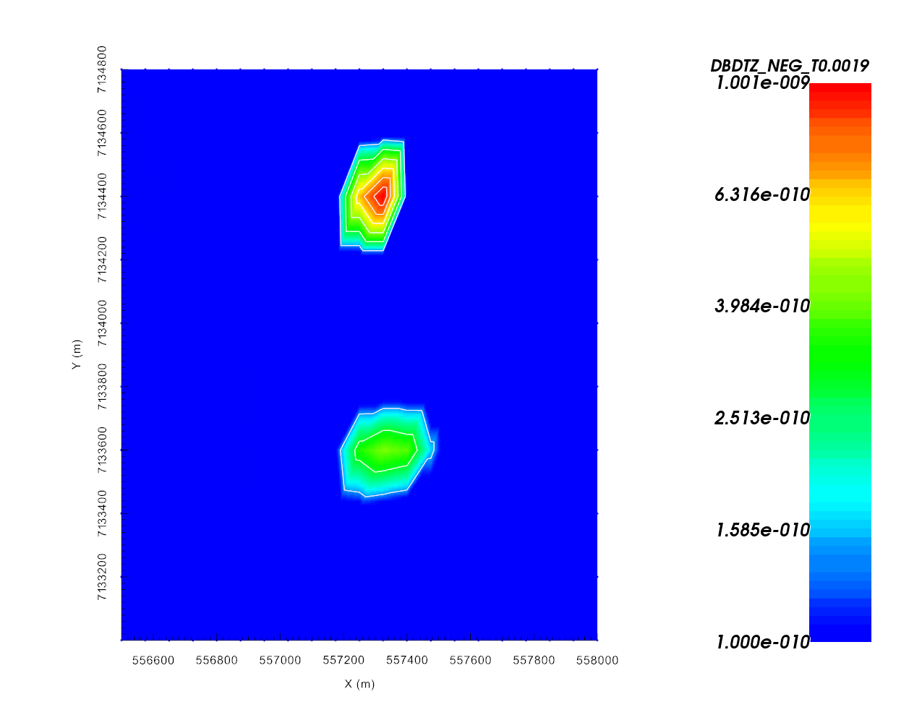

.. _AtoZem1dtm_uncertainties:

.. include:: <isonum.txt>

Specifying Parameters for TEM Sounding Inversion
================================================

.. figure:: ./../../../images/AtoZ_fem1d/xyz_to_FEM.png
    :align: right
    :scale: 50%

Here, we detail the process of defining the survey parameters used in EM1DTM
inversions. For `GIF formatted 1D TEM data
<http://em1dtm.readthedocs.io/en/latest/content/files/supporting.html>`__, the
survey parameters are automatically read into GIFtools. For :ref:`Geosoft
XYZ<XYZfile>` and :ref:`CSV<CSVfile>` files however, the survey information
must be specified by the user. In this exercise, we:

    - Define the data columns being imported from a Geosoft XYZ data file
    - Set transmitter, receiver and elevation information
    - Assign uncertainties to the data

.. _AtoZem1dtm_setup:

Setup for the Exercise
----------------------

    - `Download the demo <https://github.com/ubcgif/GIFtoolsCookbook/raw/master/assets/AtoZ_FEM1D_4Download.zip>`_ (**MAKE CORRECT LINK TO DOWNLOAD DEMO**)
    - Open GIFtools
    - :ref:`Set the working directory <projSetWorkDir>`

.. tip:: - Steps (without links) are also included with the download
         - Requires at least `GIFtools version 2.2 <https://gif.eos.ubc.ca/GIFtools/downloads2>`_ (login required)

.. _AtoZem1dtm_import:

Import files
------------

In addition to raw geophysical data, you may have access to topographical information. If this information is available, it can be imported into GIFtools.

    - :ref:`Import raw TEM data <importTemData>` from the file **TKCdata_VTEM.xyz** (Geosoft XYZ format as a TEMsounding).

        - Under *channel information*, import the time channels from the file **VTEMtimes.dat**
        - When specifying headers, choose load file and use **headers.txt**

    - :ref:`Import topography data <importTopo>` from the file **TKCtopo.dat** (3D GIF format)
    - :ref:`Import 1D mesh<importMesh>` from the file **layer.msh** (layers file)
    - :ref:`Import surface layer<importSurface>` from the file **TillLayer.topo** (3D GIF format)

.. tip:: - Use **Edit** |rarr| **Rename** to change what objects in GIFtools are called
         - For any data object, :ref:`edit the data headers <objectDataHeaders>`.
         - Raw data were generated synthetically using the best-available conductivity model for TKC and the TDoctree code.
         - The standard deviation of Gaussian noise added was determined from the uncertainties used to invert real TEM data collected over TKC.

Set Survey Information
----------------------

Since the raw data were formatted according to the Geosoft XYZ format, the transmitter and receiver information for the airborne survey must be set manually. Additionally, only an altitude column was provided in the raw data. Therefore, we must use the topography and altitude information to determine the elevation of each data point.

    - :ref:`Create elevation from surface topography<objectElevFromSurface>`

        - Click **at surface** and use the altitude data column from the TEMsounding object
        - :ref:`Set i/o header<objectSetioHeaders>` for Z to the elevation column you just created

    - :ref:`Add transmitters<objectEMaddTx>` to set the locations of the transmitters **relative to the current xyz data locations**. For the coincident loop system used for the survey we set the following parameters:

        - Loop transmitter with radius of 10 m
        - Along-line offset = 0 m
        - Cross-line offset = 0 m
        - Set vertical offset as altitude column (**ralt**) from TEMsounding object

    - :ref:`Add receivers<objectEMaddRx>` to set the locations of the receivers **relative to the transmitter locations**. Use the following parameters:

        - Dipole moment = 1 Am :math:`\! ^2`
        - Along-line offset = 0 m
        - Cross-line offset = 0 m
        - Set vertical offset as altitude column (**ralt**) from data object

    - :ref:`Set data normalization to Volts<objectEMsetDataNorm_TEM>`. This determines the data units written to the observations file and interpreted by the EM1DTM code.
    - :ref:`Set time normalization to seconds<objectEMsetTimeNorm_TEM>`
    - :ref:`Import and set waveform<objectEMwaveform_import>` using the file **VTEM.wave**

.. important:: In keeping with a commonly used convention, we have chosen to plot -dBz/dt to show a positive decaying response; thus dBz/dt for a coincident loop system is negative and decaying in the universal coordinate system used by GIFtools. When loading TEM which are not already in GIF format, it is important that the sign of the vertical response is correct.

.. raw:: html
    :file: ./AtoZ_Data_Obs.html

.. raw:: html
    :file: ./AtoZ_Data_Decay.html

.. _AtoZem1dtm_uncert_assign:

Assign Uncertainties
--------------------

Before inverting the data, we must assign uncertainties. The role of uncertainties in the inversion process is described in the :ref:`inversion fundamentals section<Fundamentals_Uncertainties>`. Because the observed response spans multiple orders of magnitudes of all time channels, and the errors on the data may vary as such, distinct floor and percent uncertainties will be computed for each time channel.

    - Use :ref:`assign simple uncertainties<objectAssignUncert>` to create data columns containing the data uncertainties. Use 1e-17 T/s + 10\%.
    - Set :ref:`i/o headers<objectSetioHeaders>` for all fields. Files used in the inversion cannot be written until this is performed.

.. note::
    The uncertainties for this exercise are based on the noise added to synthetic 3D TEM data. If the applied uncertainties are correct:
        - The recovered model will not fit the data too heavily in certain regions at the expense of others
        - The recovered model will not fit the data too heavily at certain times at the expense of others

.. figure:: ./../../../images/AtoZ_tem1d/TEMdecay_DO27.png
    :align: right
    :figwidth: 0%

.. figure:: ./../../../images/AtoZ_tem1d/TEMdecay_DO18.png
    :align: right
    :figwidth: 0%

.. figure:: ./../../../images/AtoZ_tem1d/TEMdecay_TILL.png
    :align: right
    :figwidth: 0%
