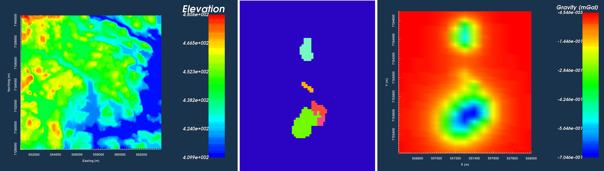
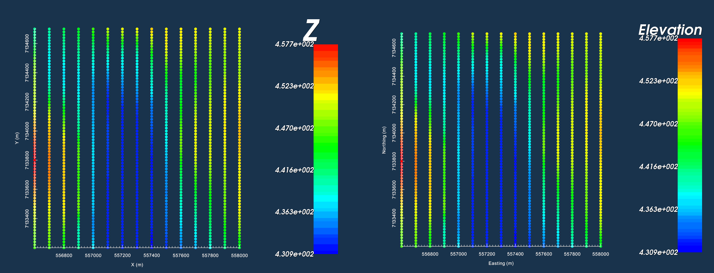

.. _AtoZGrav_Forward:

Forward Model Gravity Data and Compare Against Field Observations
=================================================================

Prelude
-------

Here, we show how GIFtools can be used to forward model gravity data for an arbitrary density model. We consider the case where we have a set of field observations and some a priori knowledge of the local geology; for this example, we know the anomaly is produced by the :ref:`TKC kimberlites <AtoZ_TKCbackground>`. The goal of this exercise is to forward model the survey data for a plausible density model, and see if the predicted gravity anomaly sufficiently matches the anomaly observed in the field data. A reasonable match ensures that our current geological understanding is able to explain the cause of the anomaly.

**NOTE: The same workflow can be used to predict magnetic data for an arbitrary susceptibility or magnetic vector models.**

Download files and start new project
------------------------------------

To complete this exercise, you must first download the necessary files and set up the working directory for your project.

    - Download the demo `Download the demo <https://owncloud.eoas.ubc.ca/s/lDVLwPD2LKI2QKK>`__
    - NOTE: Steps (without links) are also included with the download
    - NOTE: Requires at least GIFtools version 2.1.3 (Oct 2017)
    - :ref:`Set the working directory <projSetWorkDir>`

Import files
------------

In addition to geophysical data, you may have access to topographical information and/or geological surface maps/cross-sections. If this information is available to you, it can be imported to GIFtools. Here, we have surface topography and files which define several geological units through surface mapping.

    - :ref:`Import the topography data <importTopo>` (3D GIF format)
    - :ref:`Import the geology image and link to topography <importImage>` (Image is plane view)
    - :ref:`Create a legend for the geological units in the image <objectGeneralImageCreateLegend>`
    - :ref:`Import field observed gravity anomaly data <importGravData>` (GIF format)

**Note:** observed data were generated synthetically using the best-available density model for TKC.

    Topography imaged in VTK (left). Plan-view image for surface geological mapping (middle). Gravity anomaly data in gal (right).

Create a Survey
---------------

Ultimately, we would like to predict gravity data for a model of our choosing and compare it against a set of field observations. To accomplish this, we must first create a survey; which has the same properties as the actual survey that was performed. To create the survey:

    - :ref:`Create simple survey <createSurveySimple>`

**For this exercise, remember to:**

    - Set the survey type as 'Gravity'
    - Link the survey to the known topography at TKC
    - Set the height above topography to 10 m
    - Set the following parameters:
        - Easting origin: 556,600
        - Northing origin: 7,133,200
        - Bearing: 0
        - Line length: 1,500
        - Number of survey lines: 15
        - Data spacing: 20
        - Line spacing: 100

    Data location from observed data file (left). Data locations for synthetic survey (right).

