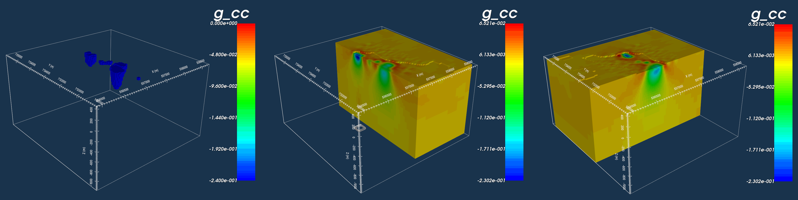

.. _AtoZGrav_Inversion:

.. include:: <isonum.txt>

Inverting Corrected Gravity Data
================================

Prelude
-------

Here, we show how GIFtools can be used to invert gravity anomaly data. We consider the case where we have a set of field observations and some a priori knowledge of the local geology; for this example, we know the anomaly is produced by the :ref:`TKC kimberlites <AtoZ_TKCbackground>`. We assume that all necessary corrections have been applied to the raw gravity data; see the :ref:`gravity data corrections tutorial <AtoZGrav_Corrections>`. The goal of this exercise is to invert the gravity anomaly data to recover the optimum density model. Several inversion will be run to show the impact of reference models and various penalty terms on the final inversion result.

.. tip:: The same workflow can be used to invert magnetic data for an arbitrary susceptibility or magnetic vector model.

Setup for the Inversion Exercise
--------------------------------

**If you have completed the tutorial** :ref:`"Forward Model Gravity Data and Compare Against Field Observations" <AtoZGrav_Forward>`:

    - Open your final GIFtools project
    - :ref:`Import the true density model <importModel>`

**If you have NOT completed the tutorial, you must complete the following steps from the tutorial:**

    - :ref:`Download the necessary files and set the working directory <AtoZGrav_Forward_Download>`
    - :ref:`Import the files into GIFtools <AtoZGrav_Forward_Import>`
    - :ref:`Create a mesh from the survey data <AtoZGrav_Forward_Mesh>`
    - :ref:`Create an active cells model and a synthetic geological model from topography and surface mapping <AtoZGrav_Forward_Model>`
    - :ref:`Import the true density model <importModel>`

Assign Uncertainties and Set I/O Headers
----------------------------------------

Assigning appropriate uncertainties to the data is necessary for running stable and successful inversions with GIFtools. Because the observed gravity data were generated synthetically, we will add random noise before assigning the uncertainties. Because the statistics of the noise are known, they can be used to assign the correct uncertainties. Complete the following steps:

    - :ref:`Add Gaussian random noise <objectAddNoise>` (Percent = 2, Floor = 0.005)
    - :ref:`Assign uncertainties to G_noisy <objectAssignUncert>` (Percent = 2, Floor = 0.005)
    - :ref:`Set I/O headers <objectSetioHeaders>` to ensure the elevation, observed data and uncertainty columns are set correctly

 .. figure:: images/DataUncertainties.png
    :align: center
    :width: 700

    Synthetic gravity anomaly data (left). Gravity anomaly data with noise (middle). Uncertainties on noisy data (right).

Unconstrained Smooth Inversion
------------------------------

Here, we perform the most basic type of gravity anomaly inversion. No a priori information is used in the inversion. Default inversion parameters use least-squares penalties on the model and its gradients. As a result, we expect the inversion to recover a smooth model. To run the inversion and view results:

    - :ref:`Create a gravity inversion object <createGravInv>`
    - :ref:`Edit the inversion parameters <invEditOptions>`
        - **Sensitivity Tab:** set the mesh, observed data and topography
        - **Inversion Tab:** set the active cells
        - **Blocky model norms:** *leave all as default*
        - Apply and write files when finished
    - :ref:`Run the inversion <invRun>`
    - :ref:`Import inversion results <invLoadResults>`
    - View the results. The user is encouraged to:
        - Compare predicted and observed data and examine the misfit
        - Lay the observed data over the final model to see if observed anomalies match the distribution of recovered densities
        - Lay the geological image over the final model to see if the inversion results agree with geological surface mapping

.. figure:: images/Inversion1_Misfit.png
    :align: center
    :width: 700

    Observed data (left). Data predicted with final model (middle). Normalized misfit (right).

    True model with only non-zero density contrasts (left). NW slice of recovered model (middle). EW slice through southern anomaly (right).

Results
^^^^^^^

    - Data predicted with the final recovered model fits the observed field data sufficiently
    - The general distribution of density contrasts is recovered through inversion.
    - By using the default set of inversion parameters however, we recovered a very smooth density contrast model
    - Because the inversion was set to recover a smooth model, the inversion placed positive density contrast values (red) around the outside of the recovered structures

Smooth Model Difference Inversion
---------------------------------

