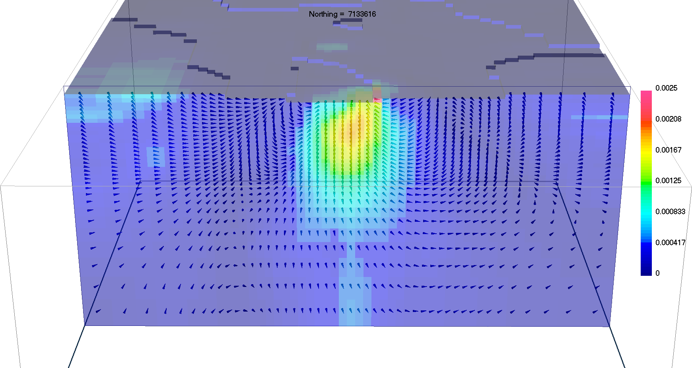
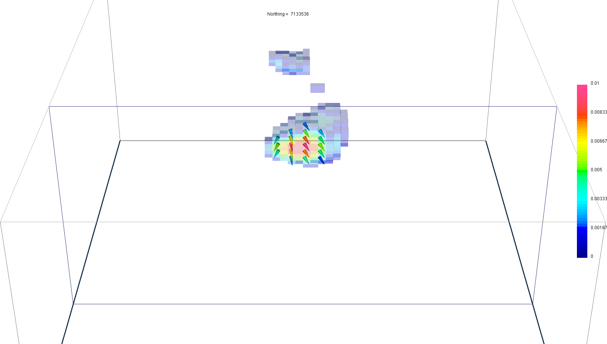

.. _AtoZMag_MVI:

Magnetic Vector Inversion (MVI)
===============================

Purpose
^^^^^^^

 - Demonstrate the basic steps for the Magnetic Vector Inversion in Cartesian (MVI-C) and Spherical (MVI-S) coordinates.
 - Improve the MVI-C solution with a cooperative inversion approach (amplitude + MVI-C)
 - Demonstrate the adavantages of a sparse MVI-S code

.. note:: Link to `MVI documentation <http://mvi.readthedocs.io/en/latest/>`_

Downloads
^^^^^^^^^

.. example::    - `Download the demo <https://owncloud.eoas.ubc.ca/s/lDVLwPD2LKI2QKK>`__
                    - Requires at least `GIFtools version 2.1.3 (Oct 2017) <https://gif.eos.ubc.ca/GIFtools/downloads2#Installation>`_
                    - Requires `MVI v2.0 <http://gif.eos.ubc.ca/GIFtools/consortium>`_

Step by step
^^^^^^^^^^^^

.. tip:: If you have already completed either the :ref:`Magnetic Susceptibility Inversion
         <AtoZMag_Susc>` or the :ref:`Magnetic Amplitude Inversion
         <AtoZMag_Amp>` demo, you may advance directly to :ref:`Step
         3<AtoZMagMVI_Step3>`

- **Step 1: Setup**
    - :ref:`Start a GIFtools project <basicFunctionality_index>`
    - :ref:`Set the working directory <projSetWorkDir>`
    - :ref:`Import the topography data <importTopo>`

- **Step 2: Survey and Data**
    - :ref:`Import the magnetic data in UBC format <magfile>`

.. _AtoZMagMVI_Step3:

- **Step 3: Processing**
    - :ref:`Create an inversion object (MVI 2.0)<createMagInv>`
        - :ref:`Edit the options <AtoZMag_invObj>`
            - Panel 1: Fill out Sensitivity Options
            - Panel 2: Adjust :math:`\alpha` parameters, same as :ref:`here <AtoZMag_alphaOpt>`
            - Click *Apply and write files*

.. _AtoZMVI_C:

- **Step 4: Run the inversion: MVI-Cartesian**
    - :ref:`Run all the files <invStep5>`
    - :ref:`Import the inversion results <invStep6>`
    - :ref:`View the convergence curves <invStep7>`

    .. note:: - The magnetic vectors with the highest amplitude are located on the eastern margin of the anomaly.
              - Although the direction of magnetization is smoothly changing, the average orientation appears to be pointing downward and towards east.
              - We can try to improve this result in two different ways
              	- Re-run cooperatively with the sparse magnetic :ref:`amplitude model<AtoZ_Mag_AmpSynthesis>`
              	- Run the :ref:`MVI-Spherical <AtoZ_Mag_MVIS>` code with sparsity constraints

- ALTERNATE ENDING #1: Run a Cooperative Magnetic Inversion (CMI): MVI-C + amplitude
    .. note:: In this inversion, we will use the compact model obtained in the :ref:`Magnetic Amplitude Inversion <AtoZMag_Amp>` demo to constrain the smooth MVI-C result.

    .. figure:: ./../../../images/AtoZ_Mag/AtoZ_Mag_MVIOptions.png
            :align: right
            :scale: 20%

    - :ref:`Copy the inversion object from MVI-C <invCopyOptions>`
    - Create a cell weighting model :math:`\mathbf{w}`
        - :ref:`Load the amplitude model file<importModelCellCentered>`
        - :ref:`Normalize the amplitude model by its maximum value<objectFunctionalityMathSimple>`: :math:`\mathbf{w} = \mathbf{m}_{amp} / max(\mathbf{m}_{amp})`
        - :ref:`Add a small threshold value <objectFunctionalityMathSimple>`: :math:`\mathbf{w} = \mathbf{w}+1e-2`
        - :ref:`Apply an inverse power function <objectFunctionalityMathSimple>`: :math:`\mathbf{w} = \mathbf{w}^{-1}`
        - :ref:`Assign the cell weights <objectMeshCreateWeights>`
    - :ref:`Write all files <invWriteAll>`
    - :ref:`Run the inversion <invRun>`
    - :ref:`Import the last inversion result <invStep6>`

.. figure:: ./../../../images/AtoZ_Mag/AtoZ_Mag_CMI.png
            :align: center
            :scale: 50%

            Sparse CMI model

.. _AtoZ_Mag_MVIS:

- ALTERNATE ENDING #2: Run the inversion: MVI-Spherical**
	.. warning:: The MVI-Spherical code (MVI 2.0) is currently under review. The example below has been completed with MVI 3.0 (expected release: early 2018).

	.. figure:: ./../../../images/AtoZ_Mag/AtoZ_Mag_InvOptions.png
            :align: right
            :scale: 20%

    - :ref:`Copy the previous inversion object <invCopyOptions>`
    - Change the inversion mode to Spherical
    - Change the sparsity parameters ->
    - :ref:`Write all files <invWriteAll>`
    - :ref:`Run the inversion <invRun>`
    - :ref:`Import the last inversion result <invStep6>`

            Sparse MVI-S model

Synthesis
^^^^^^^^^

We have recovered three magnetic vector models.

 .. raw:: html
    :file: ./AtoZ_Mag_Synthesis.html
