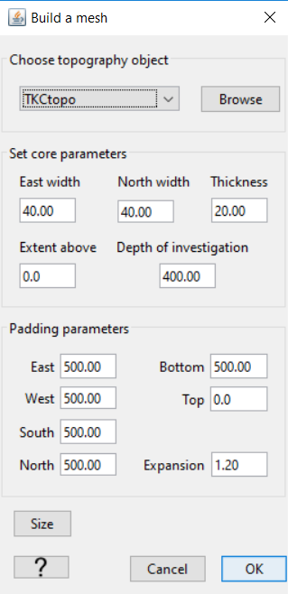
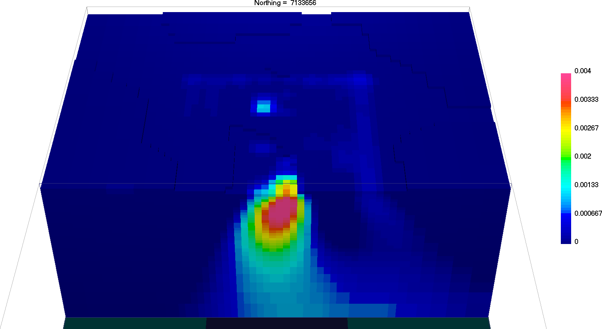
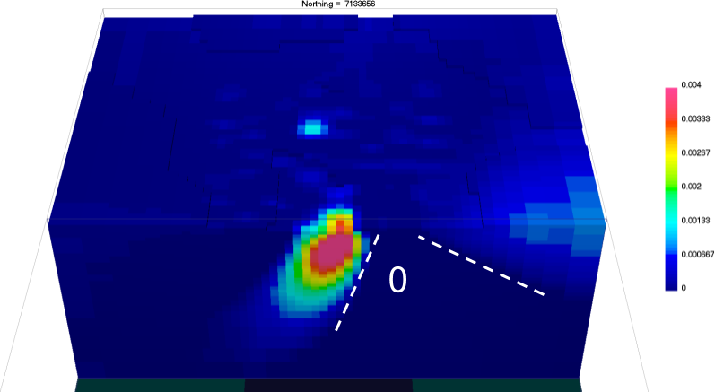

.. _AtoZMag_Susc:

.. include:: <isonum.txt>

Magnetic Susceptibility:
========================

Purpose
^^^^^^^

Demonstrate the basic steps for the inversion of magnetic data using the
induced magnetization assumption. We will start directly with *simulated* data
and topography, as it is often the case in a greenfield exploration project.

.. tip:: Link to `MAG3D documentation <http://mag3d.readthedocs.io/en/v6/index.html>`_

Downloads
^^^^^^^^^

.. example::    - `Download the demo <https://owncloud.eoas.ubc.ca/s/lDVLwPD2LKI2QKK>`__
                    - Steps (without links) are also included with the download
                    - Requires at least GIFtools version 2.1.3 (Oct 2017)
                    - Requires MAG3D v6.0

Step by step
^^^^^^^^^^^^

- **Step 1: Setup**
    - :ref:`Start a GIFtools project <basicFunctionality_index>`
    - :ref:`Set the working directory <projSetWorkDir>`
    - :ref:`Import the topography data <importTopo>`

.. figure:: images/AtoZ_Mag_LoadXYZ.png
    :align: right
    :scale: 30%

    *Click on image*

- **Step 2: Survey and Data**
    - :ref:`Import magnetic data in XYZ format <importMagData>`

    .. tip:: Assign the Easting and Northing (X, Y), but leave elevation empty. Make sure you load in both the *ralt* and *B_igrf* variables

    - :ref:`Set the field parameters for the newly created magnetic survey <objectEditFieldParam>`:
        - Field strength = 59,850 nT
        - Inclination = 83.3 degrees
        - Declination = 19.5 degrees

    .. figure:: images/AtoZ_Mag_SyntheticData_trended.png
        :align: right
        :scale: 20%

    - :ref:`Remove the IGRF from the tmi data<objectRemoveIGRF>`
    - :ref:`Assign Z value from radar altimeter and topography<assignElevTopo>`
    - :ref:`Set data uncertainties (1nT floor) <objectAssignUncert>`

    .. tip:: - The observed magnetic data is now ready for export.
             - At least two anomalies are easily identified.
             - Note the large trend in the data coming from the NE.

    *Mesh specs*

- **Step 3: Processing**
    - :ref:`Create a mesh from the observed data <objectDataCreateMesh>`
        - To reproduce this example, use the following parameters
    - :ref:`Create an inversion object (MAG3D 6.0)<createMagInv>`
    - :ref:`Edit the options <invEditOptions>`

        .. figure:: images/AtoZ_Mag_InvOptions.png
            :align: right
            :scale: 20%

            Inversion parameters

        - Panel 1: Fill out Sensitivity Options
        - Panel 2: Adjust :math:`\alpha` parameters
        - Click *Apply and write files*

.. tip:: As a general *best practice*, in the absence of a priori
         information, :math:`\alpha` values should be set such that all components of
         the regularization have equal weight. Based on the core mesh discretization:
         :math:`\alpha_s = \left[\frac{1}{dx}\right]^2` and :math:`\alpha_z = \left[\frac{1}{2}\right]^2`.

- **Step 4: Run the inversion**
    - :ref:`Run all the files <invStep5>`
    - :ref:`Import the inversion results <invStep6>`
    - :ref:`View the convergence curves <invStep7>`

- **Step 5: Interpretation**
    - Note the linear anomalies recovered on the edges of the core
         mesh. This feature is due to the regional signal captured by our survey, but extents beyond the region of interest.
         We can improve our result with the following step.

.. figure:: images/AtoZ_Mag_SyntheticData.png
            :align: right
            :scale: 20%

            De-trended data

- **Step 6: De-trend and re-run**
    - :ref:`Remove first-order trend<objectPolyTrend>`

    .. tip:: Note the large negative lobe along the NE edge of the southern mag anomaly.

    - :ref:`Create a new inversion copy <invCopyOptions>`
    - **Repeat Step 4**

.. _AtoZ_MagSuscdiscuss:

Synthesis
^^^^^^^^^

        Recovered susceptibility model

.. figure:: images/AtoZ_Mag_Misfit.png
        :align: right
        :scale: 30%

        Data residual

- We have recovered a susceptibility model that honors the data within the target misfit.
- Considering a near-vertical inducing field, at least two features should raise some serious flags regarding the presence of remanence.
    - The kimberlite pipe appears to be plunging towards SW, with a cone-shape zone of zero susceptibility.
    - The data residual map shows correlated signal near the main anomaly, indicative of poor fit of the large negative anomaly

..     - Does the survey need to be adjusted to better image the anomalous response?
..     - Are we using the right geophysical method to detect the desired target?
..     - ...
.. - Forward model
..     - Is the anomalous response large enough compared to expected noise and instrument sensitivity?
..     - How does the data change if the model has greater or less physical property contrast?
..     - How deep can the deposit be before we cannot detect it anymore?
..     - ...
.. - Inversion
..     - Does the recovered model match expectations?
..     - What can be done to improve the recovered model?
..     - What happens when we start to use non-default parameters?
..     - What happens when the uncertainties are increased or decreased?
..     - Can we include reference models? Impose bounds? Include cell and face weighting?
..     - What other information do we have to constrain the inversion?
..     - ...

