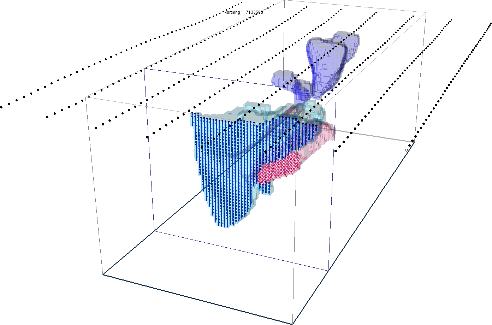

.. _AtoZMag_index:

A to Z Examples for Magnetics
=============================

Here, A to Z examples relevant to the processing and inversion of magnetic
data in the presence of remanence.  The effect of remanence has long been
recognized as an obstacle for the geological interpretation and modeling of
magnetic data, especially true in the case of TKC. This tutorial covers
three inversion approaches and compares their respective solutions:

.. toctree::
 	:maxdepth: 1

   	Magnetic susceptibility inversion <MagSusc>
   	Magnetic amplitude inversion <MagAmp>
   	Magnetic Vector Inversion (MVI) <MVI>

