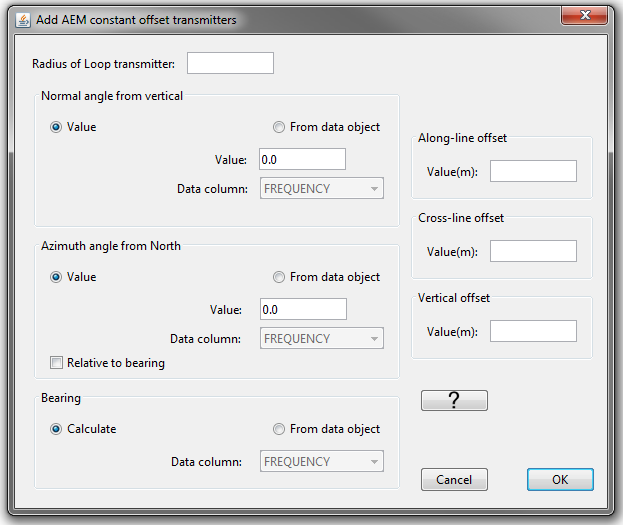

.. _objectEMdtype:

.. include:: <isonum.txt>

EM Data Menu
============

.. _objectEMaddTx:

Add Transmitters
----------------

GIF formatted FEM (link) and TEM (link) contain all necessary information pertaining to the transmitters and receivers. However, Geosoft XYZ and CSV formatted FEM and TEM data do not (links). Here, the user may specify the transmitter locations and properties based on the data locations.

Select the object and the menu **"data type menu"** |rarr| **Add transmitters**

The user may add the following types of transmitters:

	- Dipole transmitters

    An example of the fields for airborne FEM circular loop transmitters

.. _objectEMaddRx:

Add Receivers
-------------

GIF formatted FEM (link) and TEM (link) contain all necessary information pertaining to the transmitters and receivers. However, Geosoft XYZ and CSV formatted FEM and TEM data do not (links). Here, the user may specify the receiver locations and properties based on the data locations.

Select the object and the menu **"data type menu"** |rarr| **Add receivers**

The user may add the following types of receivers:

	- Dipole receivers

.. figure:: ../../../../images/object/data/em/addReceivers.png
    :align: center
    :width: 400

    An example of the fields for airborne FEM circular loop receivers

.. _objectEMremoveTx:

Remove Transmitters
-------------------

This functionality allows the user to remove transmitter information from the data object.

Select the object and the menu **"data type menu"** |rarr| **Remove transmitters**