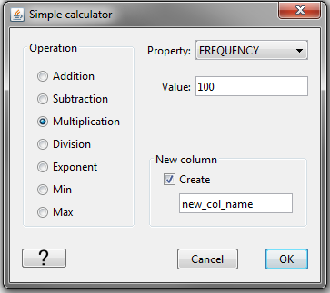

.. _objectDataManipulation:

.. include:: <isonum.txt>

Data Manipulation Menu
======================

.. _objectSetioHeaders:

Set input/output data headers
-----------------------------

Input/output (i/o) data headers are important because it symbolized the data columns that will be exported to GIF inversion codes. If i/o headers are required, but not filled, they will appear in red in the information panel provided to the right of the data object when selected:

.. figure:: ../../../../images/ioHeadRed.png
    :align: center
    :width: 400

To set the i/o header, select the object and then the menu **Data manipulation** |rarr| **set I/O headers**

.. figure:: ../../../../images/ioheader.png
    :align: center
    :width: 400

.. _objectDataDownsample:

Downsample Data
---------------

Data may be downsample in two ways: traditional removal and a mesh-based removal. With any method that deletes data locations, a *new* data object will be created after downsampling. See below for details.

Traditional downsampling
^^^^^^^^^^^^^^^^^^^^^^^^

Traditional downsampling requires a number, :math:`n`, which represents the fractional number of data kept (e.g, 3 is one-third, 4 is one-quarter). This downsampling can be done on any data object as the algorithm finds only the unique *horizontal* locations of data. To downsample the data this way, the menu structure is:

**Data manipulation** |rarr| **Downsampling** |rarr| **Simple**

.. figure:: ../../../../images/downsample.png
    :align: center
    :width: 400

**NOTE:** This method of downsampling can be reached from the :ref:`data viewer <viewData>`. Data first need to be selected (to either be downsampled or left alone) via the **View** |rarr| **Edit** |rarr| **Data selection** tab of the viwer control dialog. Then select its neighbouring tab: **View** |rarr| **Edit** |rarr| **Simple edit** and select the radio button under "Downsample area." The value associated with this will be :math:`n` as given above. A new data object name will be required.

.. figure:: ../../../../images/downsampleFromViewer.png
    :align: center
    :width: 400

Downsample by mesh
^^^^^^^^^^^^^^^^^^
The second method of downsample requires a mesh (either :ref:`3D<importMesh3D>` or :ref:`ocTree<importMeshOctree>`) and will keep only one datum location per cell. EM data will have its times/frequencies preserved. The option also allows for either the closest location to the centre of each cell or a random location in each cell will be chosen. To access this function use:

**Data manipulation** |rarr| **Downsampling** |rarr| **Mesh Based**

.. figure:: ../../../../images/downsample.png
    :align: center
    :width: 400

.. _objectMeshBasedDataRemoval:

Remove data outside mesh
------------------------

This function allows the user to remove data outside of a 3D mesh region that is of interest. With any method that deletes data locations, a *new* data object will be created after mesh-based removal. There are two options to choose: (1) removal outside the horizontal extent of the mesh or (2) removal outside the entire extent of the mesh. To perform either of these two tasks, click on the data object and then use the following menu (number corresponds from above):

#. **Data manipulation** |rarr| **Remove data** |rarr| **Outside mesh lateral extent** or

#. **Data manipulation** |rarr| **Remove data** |rarr| **Outside of an entire mesh**

.. figure:: ../../../../images/meshBasedRemoval.png
    :align: center
    :width: 400

.. _objectCalculate:

Calculate
---------

.. _objectPolyTrend:

Calculate a polynomial trend
^^^^^^^^^^^^^^^^^^^^^^^^^^^^

Any data column may have a polynomial trend calculated. For access to this feature via *magnetics* or *gravity* data, click on the data item of interest and use the menu below. For all other data types, this feature can be accessed though the :ref:`data viewer <viewData>` (See Note 2).

**Data manipulation** |rarr| **Calculate** |rarr| **Polynomial trend**

**NOTE 1:** For removal of the trend, see the :ref:`Column calculator <objectColumnCalculator>` for how to subtract one column from another within a data object.

**NOTE 2:** The calculation of a polynomial trend can be accessed in the :ref:`data viewer <viewData>`. Data first need to be selected via the **View** |rarr| **Edit** |rarr| **Data selection** tab of the viwer control dialog. Then select its neighbouring tab: **View** |rarr| **Edit** |rarr| **Regional fit**. A new data column name is manditory as well as the degree of polynomial.

.. figure:: ../../../../images/polyTrendFromViewer.png
    :align: center
    :width: 400

.. _objectConstantCalculator:

Apply a simple math operation to data
^^^^^^^^^^^^^^^^^^^^^^^^^^^^^^^^^^^^^

Any data column can have a simple mathematical operation applied given a value. To access this calculator, click on the data item of interest and use the menu:

**Data manipulation** |rarr| **Calculate** |rarr| **Constant calculator**

**NOTE 1:** Spatial (X,Y) :ref:`i/o Headers <objectSetioHeaders>` are not shown within the calculator. To apply the constant calculator to the x- or y-coordinates, remove them from the i/o header.

**NOTE 2:** The constant calculator can be accessed in the :ref:`data viewer <viewData>`. Data first need to be selected via the **View** |rarr| **Edit** |rarr| **Data selection** tab of the viwer control dialog. Then select its neighbouring tab: **View** |rarr| **Edit** |rarr| **Simple edit** and select the radio button under *Simple calculator.* The value in the section will be applied as selected. A new data object name is optional.

.. figure:: ../../../../images/downsampleFromViewer.png
    :align: center
    :width: 400

.. _objectColumnCalculator:

Apply a column-to-column math operation to data
^^^^^^^^^^^^^^^^^^^^^^^^^^^^^^^^^^^^^^^^^^^^^^^

Any data column can have a simple mathematical operation applied to it based on another data column (e.g., subtrace a trend). To access this calculator, click on the data item of interest and use the menu:

**Data manipulation** |rarr| **Calculate** |rarr| **Column calculator**

**NOTE 1:** Spatial (X,Y) :ref:`i/o Headers <objectSetioHeaders>` are not shown within the calculator. To apply the constant calculator to the x- or y-coordinates, remove them from the i/o header.

.. _objectAddNoise:

Add Gaussian noise to data
^^^^^^^^^^^^^^^^^^^^^^^^^^

On occasion, one may want to add noise to a forward modelled dataset in order to test an inversion. To add Gaussian noise to a data column or columns, click on the data item of interest and use the menu:

**Data manipulation** |rarr| **Calculate** |rarr| **Add Gaussian noise**

**NOTE 1:** Spatial (X,Y) :ref:`i/o Headers <objectSetioHeaders>` are not shown within the calculator.

.. _objectAddConstantCol:

Add Constant Column
^^^^^^^^^^^^^^^^^^^

One may want to append a constant value to the data object.

.. _objectCalcLineBearing:

Calculate line and bearing
^^^^^^^^^^^^^^^^^^^^^^^^^^

Geophysical survey are often collected along survey lines. While the data may
have Easting and Northing information, it is often useful to also know the
direction (bearing) of survey. This function groups the survey observation stations with line IDs, and provide the local bearing of each observation with respect to its nearest neighbours.

.. figure:: ../../../../images/dataCalcLineBearing.png
    :align: center
    :width: 400

**NOTE:** The assumption is made that survey points are provided in the same order as they were collected.

Coordinates
-----------

.. raw:: html
    :file: ../../../../underconstruction.html

.. figure:: ../../../../images/uncert.png
    :align: center
    :width: 400

.. _objectShiftCoord:

Shift spatial coordinates
^^^^^^^^^^^^^^^^^^^^^^^^^

.. _objectRotateCoord:

Rotate spatial coordinates
^^^^^^^^^^^^^^^^^^^^^^^^^^

.. _objectLookUpTable:

Use look-up table
^^^^^^^^^^^^^^^^^

.. _objectElevFromSurface:

Calculate elevation from surface
^^^^^^^^^^^^^^^^^^^^^^^^^^^^^^^^

.. _objectAssignUncert:

Assign uncertainties
--------------------

Assigning uncertainties is vital to inversion and therefor is also required as an :ref:`i/o header<objectSetioHeaders>`. To assign uncertainties to a data object, click on the object and select the menu **Data manipulation** |rarr| **Assign uncertainties**

.. figure:: ../../../../images/uncert.png
    :align: center
    :width: 400

**NOTE** When assigning uncertainties to EM data, the user has two options:

#. To assign a percentage and floor to all frequencies/times per data type use the menu **Data manipulation** |rarr| **Assign uncertainties** |rarr| **Simple**

#. FOR TEM data: To open up the time-dependent uncertainty dialog, use the menu **Data manipulation** |rarr| **Assign uncertainties** |rarr| **Time dependent**

#. FOR FEM data: To open up the frequency-dependent uncertainty dialog, use the menu **Data manipulation** |rarr| **Assign uncertainties** |rarr| **Time dependent**

An example from FEM data (TEM is the same structure):

.. figure:: ../../../../images/EMuncert.png
    :align: center
    :width: 400

.. _objectCombineData:

Add data from another data object of same type
----------------------------------------------

Any data object can be combined with another data object from its same class (e.g., MAGdata with MAGdata). Click on the data item of interest and, With the exception of DC/IP data (see NOTE below), use the menu:

**Data manipulation** |rarr| **Merge [data class] objects**

**NOTE: DC/IP data:** For DC or IP data, this function is found using the menu structure:

**Data manipulation** |rarr| **Add data** |rarr| **Merge [data class] objects**

.. figure:: ../../../../images/dcipAddMenu.png
    :align: center
    :width: 400

.. _objectCreateDiffData:

Create different data type
--------------------------

.. raw:: html
    :file: ../../../../underconstruction.html

