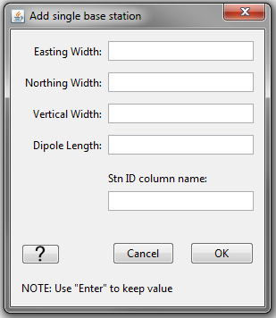

.. _objectDataTypeMT:

.. include:: <isonum.txt>

MT "Data Type" Data Menu
========================

.. _objectDataTypeMT_snid:

Set/Reset Receivers from Data Locations
---------------------------------------

To forward model or invert impedance data using the E3DMT version 2 code, all wire receivers that measure the electric field and all inductive loop receivers that measure the magnetic field must be defined. If data were loaded into GIFtools using EDI, MTZ3D or E3DMT version 1 formats, this functionality can be used to define the dimensions of the wire and loop receivers from the data locations. If data were loaded from an E3DMT version 2 data file, then the receivers are automatically defined according to the `receiver file <https://e3dmt.readthedocs.io/en/latest/content/files/receiverFile.html>`__ . This functionality is accessed via: 

**[data type]** |rarr| **Set/reset receivers from data locations**

In the pop-up window shown below, the user specifies the following:

    - **Easting width:** the width along the Easting direction for loops that measure Hy
    - **Northing width:** the width along the Northing direction for loops that measure Hx
    - **Vertical width:** the width along the vertical direction for loops that measure Hx and Hy
    - **Dipole length:** the length of the wires that measure Ex and Ey
    - **Stn ID column name:** the name of the data header given to the SNID column

Some things to note about this functionality:

    - The centers of wire and loop receivers are at the location of the associated datum.
    - By using this functionality, you will replace the receivers and receiver index column associated with this data object.

.. _objectDataTypeMT_export:

Export Observation/Locations
----------------------------

.. _objectDataTypeMT_export1:

E3DMT version 1 format (Impedance only)
^^^^^^^^^^^^^^^^^^^^^^^^^^^^^^^^^^^^^^^

The E3DMT version 1 code can forward model and jointly invert data from multiple impedance tensor and/or ZTEM data objects. When selecting an impedance data object and choosing **Impedance data** |rarr| **Export**, a pop-up window appears (see below). The user then:

    1) Select the impedance and/or ZTEM data objects they would like to export into a single observations/locations file
    2) Select *OK*

.. figure:: ../../../../images/object/data/nsem/export.png
    :align: center
    :width: 400

Some things to note about this functionality:

    - The order in which you select the data objects is the order in which the observations/locations show up in the exported file.
    - You cannot export apparent resistivity and phase data.
    - When loading predicted data, it is important to remember the order or data objects you used to create the locations file. If forward modeling or inversion is done through the GUI, the forward modeling/inversion object will remember the correct order.
    - If all data headers are set for all objects, an observations file is exported. If no data headers are set for any object, a locations file is exported.

.. _objectDataTypeMT_export2:

E3DMT version 2 format (Impedance only)
^^^^^^^^^^^^^^^^^^^^^^^^^^^^^^^^^^^^^^^

The E3DMT version 2 code requires an `observations <https://e3dmt.readthedocs.io/en/latest/content/files/obsFile.html#version-2-2017>`__ or `survey index <https://e3dmt.readthedocs.io/en/latest/content/files/indexFile.html>`__ file, a `receivers file <https://e3dmt.readthedocs.io/en/latest/content/files/receiverFile.html>`__ and a `frequencies file <https://e3dmt.readthedocs.io/en/latest/content/files/freqFile.html>`__ form the third pup-up window. The user selects the `observations <https://e3dmt.readthedocs.io/en/latest/content/files/obsFile.html#version-2-2017>`__ or `survey index file <https://e3dmt.readthedocs.io/en/latest/content/files/indexFile.html>`__ from the first pop-up window, the `receivers file <https://e3dmt.readthedocs.io/en/latest/content/files/receiverFile.html>`__ from the second pop-up window, and the `frequencies file <https://e3dmt.readthedocs.io/en/latest/content/files/freqFile.html>`__ form the third pup-up window.

Export as EDI
^^^^^^^^^^^^^

GIFtools can export impedance tensor or apparent resistivity data as EDI formatted files. This functionality is accessed through

**[data type] data** |rarr| **Export** |rarr| **Export as EDI files**

The user then chooses a directory for the EDI files and fills out the following fields:

    .. figure:: ../../../../images/object/data/nsem/exportEDI.png
        :align: center
        :width: 400

    - **Hemisphere:** Whether the survey is in the Northern or Southern hemisphere

    - **UTM Zone:** Set the UTM zone

    - **Root Name:** Root name for EDI files. Default is "STN"

    - **Export Coordinates:** GIFtools uses a convention for impedance tensor elements and apparent resistivities such that X = Northing, Y = Easting and Z = Down. The user is encouraged to keep this convention as it is standard for MT. However, the user may chance the convention for the data if desired.

.. important::

    - GIFtools converts impedance data from a :math:`-i\omega t` (GIF standard) convention to a :math:`+i\omega t` (EMAP standard) convention automatically upon output.
    - GIFtools converted impedance tensor data from V/A (GIF) to units mV/km/nT (EMAP standard).
    - GIFtools will the data point locations from WGS84 UTM to (LONG, LAT).

