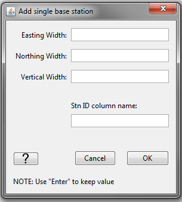

.. _objectDataTypeZTEM:

.. include:: <isonum.txt>

ZTEM "Data Type" Data Menu
==========================

.. _objectDataTypeZTEM_datatype:

Set ZTEM Data Type
------------------

For the E3DMT version 1 code, there are several inversion options for inverting ZTEM data:

	- MTT: A fix base station is used to measure Hx and Hy, while Hz is measured at each data locations
	- MTE: Same as above, however the values for Hx and Hy are computed from the starting model
	- MTH: No base station. Hx, Hy and Hz are all measured at every data location

This functionality can be accessed via:

**ZTEM data** |rarr| **Set ZTEM data type**

Some things to note about this functionality

	- If the user chooses type *MTT* or *MTE*, they will need to :ref:`set/reset base station <objectDataTypeZTEM_basestn>` and set the io Header for the BASEID column to use the E3DMT version 1 code.
	- As of right now, the E3DMT version 2 code only supports *MTH*. In the future, this may change.

.. _objectDataTypeZTEM_basestn:

Set/Reset Base Station
----------------------

To forward model or invert ZTEM data using the MTZ3D or E3DMT version 1 codes, the base station must first be defined. If data were loaded into GIFtools using EDI or E3DMT version 2 formats, this functionality can be used to define the base station. If data were loaded from and E3DMT version 1 or MTZ3D data file, then the base station may automatically be defined. This functionality is accessed via:

**ZTEM data** |rarr| **Set/reset base station**

In the pop-up window shown below, the user specifies the following:

    - **Easting:** the Easting coordinate location of the base station
    - **Northing:** the Northing coordinate location of the base station
    - **Vertical:** the elevation coordinate location of the base station
    - **ID header:** the name of the data header given to the BASEID column

.. figure:: ../../../../images/object/data/nsem/setBaseStn.png
    :align: center
    :width: 250

Some things to note about this functionality:

	- By using this functionality, you will replace any pre-existing base locations and replace the base station index column
	- As of right now, the E3DMT version 2 does not use base stations. In the future, this may change.

.. _objectDataTypeZTEM_snid:

Set/Reset Receivers from Data Locations
---------------------------------------

To forward model or invert ZTEM data using the E3DMT version 2 code, all inductive loop receivers that measure the magnetic field must be defined. If data were loaded into GIFtools using EDI, MTZ3D or E3DMT version 1 formats, this functionality can be used to define the dimensions of the loop receivers from the data locations. If data were loaded from an E3DMT version 2 data file, then the receivers are automatically defined according to the `receiver file <https://e3dmt.readthedocs.io/en/latest/content/files/receiverFile.html>`__ . This functionality is accessed via: 

**ZTEM data** |rarr| **Set/reset receivers from data locations**

In the pop-up window shown below, the user specifies the following:

    - **Easting width:** the width along the Easting direction for loops that measure Hy and Hz
    - **Northing width:** the width along the Northing direction for loops that measure Hx and Hz
    - **Vertical width:** the width along the vertical direction for loops that measure Hx and Hy
    - **Stn ID column name:** the name of the data header given to the SNID column

Some things to note about this functionality:

    - The centers of loop receivers are at the location of the associated datum.
    - By using this functionality, you will replace the receivers and receiver index column associated with this data object.

.. _objectDataTypeZTEM_rmbase:

Remove Base Station
-------------------

This functionality removes all base stations associate with the ZTEM data object. This functionality is accessed via:

**ZTEM data** |rarr| **Remove base station**

.. _objectDataTypeZTEM_export:

Export Observation/Locations
----------------------------

.. _objectDataTypeZTEM_export1:

E3DMT version 1 format
^^^^^^^^^^^^^^^^^^^^^^

This functionality is described within the :ref:`MT section <objectDataTypeMT_export1>`.

.. _objectDataTypeZTEM_export2:

E3DMT version 2 format
^^^^^^^^^^^^^^^^^^^^^^

This functionality is described within the :ref:`MT section <objectDataTypeMT_export2>`.

