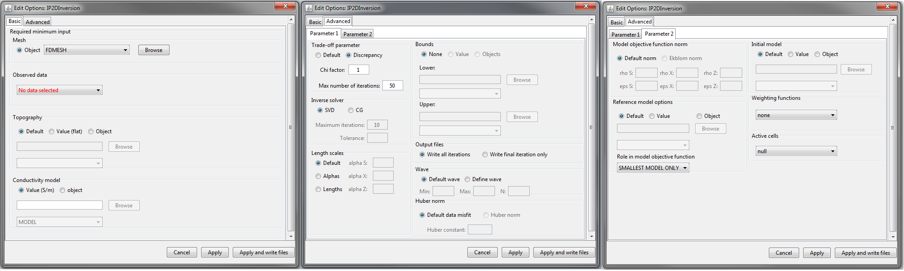

.. _invEditOptions_dcip2d:

.. include:: <isonum.txt>

Edit Options for 2D DCIP Inversion Objects
==========================================

This functionality is responsible for setting all inversion parameters pertaining to the "DC2Dinversion" and "IP2Dinversion" codes. The edit options window is comprised of 2 tabs:

    - **Basic:** Sets minimum required input for the inversion

    - **Advanced:** Sets advanced parameters for the inversion, including: the solver, regularization, weights and hard constraints 

    Basic (left), advanced parameters 1 (middle) and advanced parameters 2 (right) tabs.

Basic
-----

	- **Mesh:** mesh object for the inversion
	- **Observed data:** DC or IP data depending on inversion
	- **Topography:**

	    	- *Default:* Sets topography assuming all electrode are located on the Earth's surface
	    	- *Value:* Set the surface to the specified elevation value
	    	- *Object:* A 2D topography data object

	- **Conductivity Model (IP inversion only):** Constant value or conductivity model object. Reference and starting models are set in the advanced parameters tab.

Advanced (Parameter 1)
----------------------

**Trade-off parameter:** The inversion choses the optimum trade-off parameter based on the :ref:`chi factor <Fundamentals_Beta_Discrepancy>`.

	- **Chi factor**: sets the target data misfit for the inversion (*default* = 1). :math:`target = C.F. \times \# \, data`.
	- **Max number of iterations:** maximum number of iterations to find optimum trade-off parameter (*default* = 50).

**Inverse solver:** Sets the solver used to determine the model update direction.

	- **SVD:** Singular value decomposition
	- **CG:** Conjugate gradient solver. The user may specify the number of conjugate gradient iterations (*default* = 10) and the accuracy of the solve (*default* = 0.01).

**Length scales:** Sets the weights for smallness and smoothness regularization in x and z; for relevant equations `see manual <http://dcip2d.readthedocs.io/en/latest/content/backgroundtheory.html#equation-intMOF>`__ .

	- **Default:** Sets the values of *alpha S*, *alpha X* and *alpha Z* based on cell dimensions
	- **Alphas:** Sets specific values for *alpha S*, *alpha X* and *alpha Z*
	- **Lengths:** User sets values *Len E* and *Len Z* which define the values of *alpha X* and *alpha Z* relative to *alpha X*. These relationships are given by :math:`L_x = \sqrt{\frac{\alpha_x}{\alpha_s}}` and :math:`L_z = \sqrt{\frac{\alpha_z}{\alpha_s}}`.

**Bounds:** Here, the user specified the lower and upper bounds for the inverted physical property values. For both lower and upper bounds, the user may choose from the following options:

	- **None:** No bounds
	- **Value:** A constant value applied to all cells
	- **Object:** A model object containing a distinct bound value for every cell

**Output files:** Here, the user controls the number of output files. They may choose to output every iteration of the inversion or just the final result

**Wave:** To solve the 2D forward problem, the problem must be solved in the wave domain. *N* specifies the number of log-distribution waves numbers used between *Min* and *Max*. The default is set to: *N* = 13, *Min* = 2.5e-4 and *Max* = 1.

**Huber norm:** Here, the user specifies the norm for the data misfit. For description of the data misfit see the `DCIP2D manual <http://dcip2d.readthedocs.io/en/latest/content/backgroundtheory.html#equation-phid>`__ .

	- **Default data misfit:** the data misfit is defined by an :math:`L_2 \!` -norm
	- **Huber norm:** the data misfit is defined by the Huber norm and the user may specify the Huber constant (:math:`c`). 

Advanced (Parameter 2)
----------------------

**Model objective function norm:** Here, the user specifies the norm for the smallness and smoothness in X and Z. Background information regarding the model objective function norm and relevant parameters can be found within the `DCIP2D manual <http://dcip2d.readthedocs.io/en/latest/content/backgroundtheory.html#equation-intMOF>`__

	- **Default norm:** an :math:`L_2 \!`-norm is used for the smallness and smoothness terms
	- **Ekblom norm (CG solver only):** The Ekblom norm can be used to recover more compact and blockier models. For each term in the model objective function, the user specifies the parameters :math:`\epsilon` and :math:`\rho`.

**Reference model:** Here, the user specifies the reference model used in the inversion. There are 3 choices:

	- **Default:** no reference model is used
	- **Value:** a constant reference model is used
	- **Object:** the user specifies a model object as the reference model

**Role in the model objective function:** Here, the user chooses from the following 2 options in the case a reference model is used:

	- **SMALLEST MODEL ONLY:** The reference model is only used in the smallness term. The inversion attempts to preserve the structures found in the reference model.
	- **ALL DERIVATIVES:** The reference model is used in the smallness and smoothness terms. The inversion attempts to preserve the structures and gradients found the in the reference model.

**Initial model:** The user specifies the starting model. There are 3 choices:

	- **Default:** the best-fitting half spaced is used as a starting model
	- **Value:** a constant reference model is used
	- **Object:** the user specifies a model object as the reference model

**Weighting functions:** Here, the user may choose not to include additional model weights (**none**) or include face/model weights using a weights object

**Active cells:** If all cells are updated during the inversion, set as **null**. If an active cells model is supplied, only the cells which are set as active will be updated during the inversion. The values of the remaining cells are determined by the starting model. 

