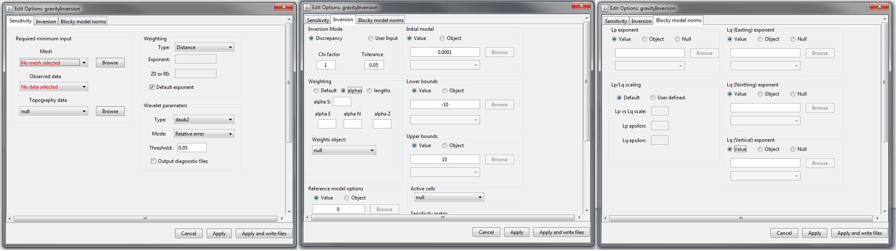

.. _invEditOptions_mag:

.. include:: <isonum.txt>

Edit Options for Magnetic Inversion Objects
===========================================

.. _invEditOptions_Mag3D:

Mag and Mag Amplitude Inversion
-------------------------------

This functionality is responsible for setting all inversion parameters pertaining to the 3D magnetic inversion codes (Mag inversion and Mag amplitude inversion); see `MAG3D background theory <http://mag3d.readthedocs.io/en/latest/content/theory.html>`__. The edit options window is comprised of 3 tabs:

    - **Sensitivity:** Sets the mesh, observed data, topography, `sensitivity weighting <http://mag3d.readthedocs.io/en/latest/content/theory.html#depth-weighting-and-distance-weighting>`__ and `wavelet compression <http://mag3d.readthedocs.io/en/latest/content/theory.html#wavelet-compression-of-sensitivity-matrix>`__
    - **Inversion:** Sets protocols for the :ref:`trade-off parameter<Fundamentals_Beta>` (:math:`\beta`) and all parameters pertaining to the model objective function (:ref:`alphas<Fundamentals_alphas>`, :ref:`cells weights<Fundamentals_WeightingMatrix>`, upper and lower bounds, active cells, reference models and starting models)
    - **Blocky model norms (ver 5.1 and above):** can be activated to recover sparse and blocky models; see :ref:`sparse and blocky norms<Fundamentals_Norms>`

    Sensitivity (left), inversion (middle) and blocky model norms (right) tabs for MAG inversion and MAG amplitude inversion objects.

.. _invEditOptions_MVI:

MVI Inversion
-------------

.. _invEditOptions_MAGOCTDE:

Mag PDE Inversion
-----------------

